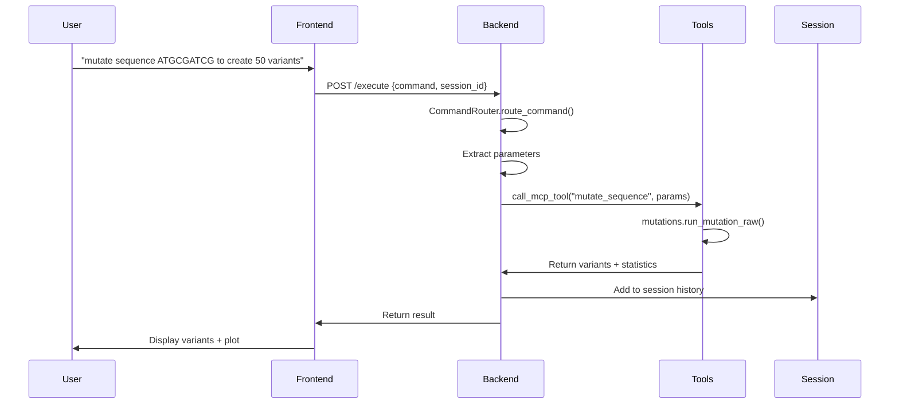
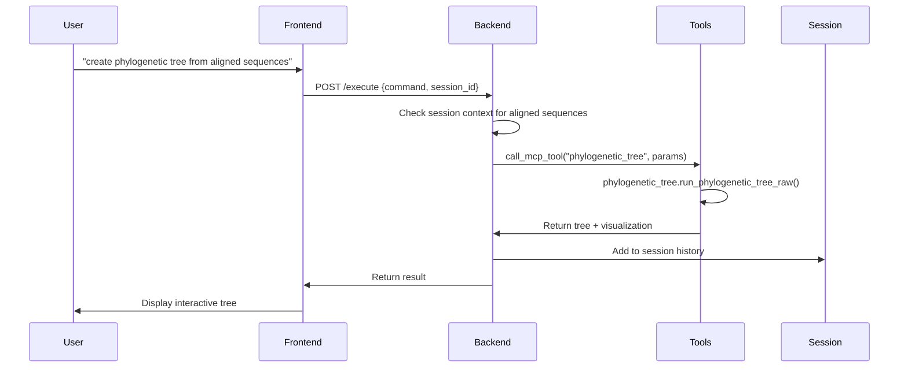
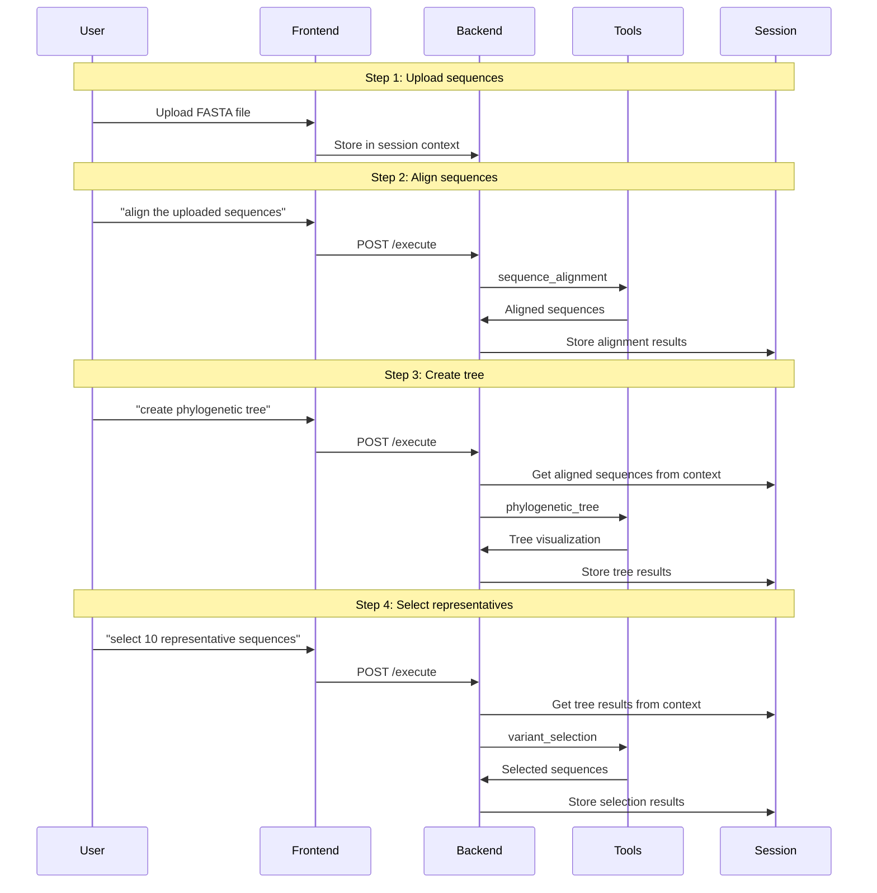

# 🧬 MCP Data/Control Flow Documentation

## Overview

Helix.AI implements a sophisticated **Model Context Protocol (MCP)** architecture that bridges natural language commands from the frontend with bioinformatics tools. This document explains the complete data and control flow from user input to tool execution and response.

## Table of Contents

- [Architecture Overview](#architecture-overview)
- [Data Flow Diagram](#data-flow-diagram)
- [Component Breakdown](#component-breakdown)
- [Command Processing Flow](#command-processing-flow)
- [Session Management](#session-management)
- [Tool Execution](#tool-execution)
- [Error Handling](#error-handling)
- [Example Workflows](#example-workflows)
- [API Endpoints](#api-endpoints)
- [Configuration](#configuration)

## Architecture Overview

The application uses a **hybrid MCP approach** that implements MCP concepts without requiring a traditional MCP server:

- **Tool Registry**: Tools are registered with schemas and descriptions
- **Command Routing**: Natural language commands are routed to appropriate tools
- **Session Management**: Context is maintained across commands
- **Tool Execution**: Tools are called with proper parameters and error handling

### Key Components

```
Frontend (React) ←→ FastAPI Backend ←→ MCP Tools ←→ Bioinformatics Libraries
     ↓                    ↓                    ↓                    ↓
Natural Language    Command Router      Tool Execution    Sequence Analysis
Commands           Session Manager     History Tracking   Visualization
```

## Data Flow Diagram

```mermaid
graph TD
    A[Frontend User Input] --> B[React UI]
    B --> C[mcpApi.ts]
    C --> D[FastAPI Backend]
    
    D --> E{Command Type?}
    E -->|Natural Language| F[/execute endpoint]
    E -->|Direct Tool Call| G[/mcp/tool-specific endpoint]
    
    F --> H[CommandRouter.route_command()]
    H --> I[Keyword Matching]
    I --> J[Tool Selection]
    
    J --> K[call_mcp_tool()]
    G --> K
    
    K --> L{Tool Type?}
    L -->|sequence_alignment| M[alignment.py]
    L -->|mutate_sequence| N[mutations.py]
    L -->|phylogenetic_tree| O[phylogenetic_tree.py]
    L -->|plasmid_visualization| P[plasmid_visualizer.py]
    L -->|dna_vendor_research| Q[dna_vendor_research.py]
    L -->|variant_selection| R[variant_selection.py]
    L -->|clustering_analysis| S[phylogenetic_tree.py]
    
    M --> T[Tool Execution]
    N --> T
    O --> T
    P --> T
    Q --> T
    R --> T
    S --> T
    
    T --> U[HistoryManager.add_history_entry()]
    U --> V[Session Context Update]
    V --> W[Result Serialization]
    W --> X[CustomJSONResponse]
    X --> Y[Frontend Response]
    Y --> Z[UI Update]
    
    %% Session Management
    V --> AA[Session Storage]
    AA --> BB[Session Context for Next Command]
    BB --> H
    
    %% Error Handling
    T --> CC{Success?}
    CC -->|No| DD[Error Response]
    CC -->|Yes| U
    
    %% Styling
    classDef frontend fill:#e1f5fe
    classDef backend fill:#f3e5f5
    classDef tools fill:#e8f5e8
    classDef session fill:#fff3e0
    
    class A,B,C,Z frontend
    class D,F,G,H,I,J,K backend
    class M,N,O,P,Q,R,S tools
    class U,V,AA,BB session
```

## Component Breakdown

### 1. Frontend Layer

#### React UI (`frontend/src/App.tsx`)
- **Purpose**: User interface for command input and result display
- **Features**: Drag-and-drop file upload, natural language input, real-time feedback

#### MCP API Service (`frontend/src/services/mcpApi.ts`)
```typescript
// Key API methods
export const mcpApi = {
  executeCommand: async (command: string, sessionId?: string) => {
    const response = await axios.post(`${API_BASE_URL}/execute`, { 
      command,
      session_id: sessionId 
    });
    return response.data;
  },
  
  handleNaturalCommand: async (command: string, sessionId?: string) => {
    const response = await axios.post(`${API_BASE_URL}/mcp/handle-natural-command`, {
      command,
      session_id: sessionId
    });
    return response.data;
  }
};
```

### 2. Backend Layer

#### FastAPI Application (`backend/main_with_mcp.py`)
- **Purpose**: Main API server with MCP integration
- **Key Endpoints**: `/execute`, `/mcp/*`, `/session/*`

#### Command Router (`backend/command_router.py`)
```python
class CommandRouter:
    def __init__(self):
        self.tool_mappings = {
            'sequence_alignment': {
                'keywords': ['align', 'alignment', 'compare sequences'],
                'description': 'Align DNA/RNA sequences'
            },
            'mutate_sequence': {
                'keywords': ['mutate', 'mutation', 'variant'],
                'description': 'Create sequence variants'
            },
            # ... more mappings
        }
    
    def route_command(self, command: str, session_context: Dict[str, Any]):
        command_lower = command.lower()
        
        # Priority-based matching
        if 'phylogenetic tree' in command_lower:
            return 'phylogenetic_tree', parameters
        elif 'mutate' in command_lower:
            return 'mutate_sequence', parameters
        # ... more routing logic
```

#### History Manager (`backend/history_manager.py`)
```python
class HistoryManager:
    def __init__(self, storage_dir: str = "sessions"):
        self.storage_dir = Path(storage_dir)
        self.sessions: Dict[str, Dict[str, Any]] = {}
    
    def create_session(self, user_id: Optional[str] = None) -> str:
        session_id = str(uuid.uuid4())
        session_data = {
            "session_id": session_id,
            "user_id": user_id,
            "created_at": datetime.now().isoformat(),
            "history": [],
            "results": {},
            "metadata": {}
        }
        self.sessions[session_id] = session_data
        return session_id
    
    def add_history_entry(self, session_id: str, command: str, tool: str, 
                         result: Dict[str, Any], metadata: Optional[Dict[str, Any]] = None):
        # Add command to session history
        # Store results for context
        # Update session metadata
```

### 3. Tool Layer

#### MCP Tool Registry
```python
# Available tools with schemas
TOOLS = {
    "sequence_alignment": {
        "description": "Perform multiple sequence alignment",
        "input_schema": {
            "sequences": "string (FASTA format)",
            "algorithm": "string (clustal|muscle|mafft)"
        }
    },
    "mutate_sequence": {
        "description": "Generate sequence variants",
        "input_schema": {
            "sequence": "string",
            "num_variants": "integer",
            "mutation_rate": "float"
        }
    },
    # ... more tools
}
```

#### Tool Execution (`backend/main_with_mcp.py`)
```python
async def call_mcp_tool(tool_name: str, arguments: Dict[str, Any]) -> Dict[str, Any]:
    """Call an MCP tool and return the result."""
    
    if tool_name == "sequence_alignment":
        import alignment
        return alignment.run_alignment(arguments.get("sequences", ""))
    
    elif tool_name == "mutate_sequence":
        import mutations
        return mutations.run_mutation_raw(
            arguments.get("sequence", ""),
            arguments.get("num_variants", 96)
        )
    
    elif tool_name == "phylogenetic_tree":
        import phylogenetic_tree
        return phylogenetic_tree.run_phylogenetic_tree_raw(
            arguments.get("aligned_sequences", "")
        )
    
    # ... more tool handlers
```

## Command Processing Flow

### Step-by-Step Process

#### 1. **User Input Reception**
```typescript
// Frontend receives user command
const handleCommand = async (command: string) => {
  try {
    const response = await mcpApi.executeCommand(command, sessionId);
    updateUI(response.result);
  } catch (error) {
    handleError(error);
  }
};
```

#### 2. **Backend Command Processing**
```python
@app.post("/execute")
async def execute(req: CommandRequest):
    try:
        # 1. Session management
        if not req.session_id:
            req.session_id = history_manager.create_session()
        
        # 2. Get session context
        session_context = {}
        if req.session_id in history_manager.sessions:
            session_context = history_manager.sessions[req.session_id]
        
        # 3. Command routing
        command_router = CommandRouter()
        tool_name, parameters = command_router.route_command(req.command, session_context)
        
        # 4. Tool execution
        result = await call_mcp_tool(tool_name, parameters)
        
        # 5. History tracking
        history_manager.add_history_entry(
            req.session_id,
            req.command,
            tool_name,
            result
        )
        
        return CustomJSONResponse({
            "success": True,
            "result": result,
            "session_id": req.session_id
        })
    except Exception as e:
        return CustomJSONResponse({
            "success": False,
            "error": str(e),
            "session_id": req.session_id
        })
```

#### 3. **Command Routing Logic**
```python
def route_command(self, command: str, session_context: Dict[str, Any]):
    command_lower = command.lower()
    
    # Priority-based matching (most specific first)
    if any(phrase in command_lower for phrase in ['cluster', 'clustering']):
        return 'clustering_analysis', self._extract_parameters(command, 'clustering_analysis', session_context)
    
    if any(phrase in command_lower for phrase in ['select variants', 'top variants']):
        return 'variant_selection', self._extract_parameters(command, 'variant_selection', session_context)
    
    if any(phrase in command_lower for phrase in ['phylogenetic tree', 'evolutionary tree']):
        return 'phylogenetic_tree', self._extract_parameters(command, 'phylogenetic_tree', session_context)
    
    if any(phrase in command_lower for phrase in ['mutate', 'mutation', 'variant']):
        return 'mutate_sequence', self._extract_parameters(command, 'mutate_sequence', session_context)
    
    # ... more routing logic
```

#### 4. **Parameter Extraction**
```python
def _extract_parameters(self, command: str, tool_name: str, session_context: Dict[str, Any]) -> Dict[str, Any]:
    """Extract parameters from command and session context."""
    
    parameters = {}
    
    if tool_name == "mutate_sequence":
        # Extract sequence from command or session context
        sequence_match = re.search(r'sequence\s+([ATGC]+)', command, re.IGNORECASE)
        if sequence_match:
            parameters["sequence"] = sequence_match.group(1)
        elif "mutated_sequences" in session_context:
            parameters["sequence"] = session_context["mutated_sequences"][-1]
        
        # Extract number of variants
        variant_match = re.search(r'(\d+)\s+variants?', command)
        if variant_match:
            parameters["num_variants"] = int(variant_match.group(1))
        else:
            parameters["num_variants"] = 96  # default
    
    elif tool_name == "sequence_alignment":
        # Extract sequences from command or session context
        if "aligned_sequences" in session_context:
            parameters["sequences"] = session_context["aligned_sequences"]
        else:
            # Parse FASTA from command
            parameters["sequences"] = self._extract_fasta_from_command(command)
    
    return parameters
```

## Session Management

### Session Context Structure
```python
session_context = {
    "session_id": "uuid-string",
    "user_id": "optional-user-id",
    "created_at": "2024-01-01T00:00:00",
    "updated_at": "2024-01-01T00:00:00",
    "history": [
        {
            "timestamp": "2024-01-01T00:00:00",
            "command": "mutate sequence ATGCGATCG",
            "tool": "mutate_sequence",
            "result": {...},
            "metadata": {...}
        }
    ],
    "results": {
        "mutated_sequences": ["ATGCGATCG", "ATGCGATCC", ...],
        "alignment_results": {...},
        "phylogenetic_tree": {...},
        "selected_variants": [...]
    },
    "metadata": {
        "current_workflow": "mutation_analysis",
        "last_tool": "mutate_sequence",
        "sequence_count": 50
    }
}
```

### Context Preservation
```python
# Example: Multi-step workflow
# Step 1: User uploads sequences
session_context["uploaded_sequences"] = ["ATGCGATCG", "ATGCGATCC"]

# Step 2: User aligns sequences
session_context["alignment_results"] = {...}

# Step 3: User creates phylogenetic tree
# Tool can access previous results from session_context
if "alignment_results" in session_context:
    aligned_sequences = session_context["alignment_results"]["aligned_data"]
    tree_result = create_phylogenetic_tree(aligned_sequences)
```

## Tool Execution

### Bioinformatics Tools Available

| Tool | Purpose | Input | Output |
|------|---------|-------|--------|
| `sequence_alignment` | Multiple sequence alignment | FASTA sequences | Aligned sequences + statistics |
| `mutate_sequence` | Generate sequence variants | DNA sequence + parameters | Variant sequences + plots |
| `phylogenetic_tree` | Create evolutionary trees | Aligned sequences | Tree visualization + metrics |
| `plasmid_visualization` | Visualize plasmid constructs | Vector + insert data | Plasmid diagram |
| `dna_vendor_research` | Research synthesis vendors | Sequence length + quantity | Vendor comparison |
| `variant_selection` | Select representative variants | Variants + criteria | Selected sequences |
| `clustering_analysis` | Cluster sequences | Aligned sequences | Representative sequences |

### Tool Execution Example
```python
# Example: Mutation tool execution
async def handle_mutate_sequence(arguments: Dict[str, Any]) -> Dict[str, Any]:
    sequence = arguments.get("sequence", "")
    num_variants = arguments.get("num_variants", 96)
    mutation_rate = arguments.get("mutation_rate", 0.1)
    
    # Execute bioinformatics tool
    result = mutations.run_mutation_raw(sequence, num_variants, mutation_rate)
    
    # Format response for frontend
    return {
        "success": True,
        "result": {
            "variants": result.get("variants", []),
            "statistics": result.get("statistics", {}),
            "plot": result.get("plot", {}),
            "text": f"Generated {len(result.get('variants', []))} variants"
        }
    }
```

## Error Handling

### Error Response Structure
```python
{
    "success": False,
    "error": "Error message",
    "error_type": "validation|execution|tool_not_found",
    "suggestion": "Try a different command or check available tools",
    "session_id": "session-uuid"
}
```

### Error Types

1. **Validation Errors**: Invalid input parameters
2. **Execution Errors**: Tool execution failures
3. **Tool Not Found**: Unknown command routing
4. **Session Errors**: Session management issues

### Error Handling Example
```python
try:
    result = await call_mcp_tool(tool_name, parameters)
    return CustomJSONResponse({
        "success": True,
        "result": result,
        "session_id": req.session_id
    })
except ValueError as e:
    # Handle unknown tool errors gracefully
    error_result = {
        "status": "error",
        "message": str(e),
        "tool": tool_name,
        "suggestion": "Try a different command or check available tools"
    }
    return CustomJSONResponse({
        "success": False,
        "result": error_result,
        "session_id": req.session_id
    })
except Exception as e:
    return CustomJSONResponse({
        "success": False,
        "error": str(e),
        "session_id": req.session_id
    })
```

## Example Workflows

### Workflow 1: Sequence Mutation Analysis



### Workflow 2: Phylogenetic Tree Creation



### Workflow 3: Multi-step Analysis



## API Endpoints

### Core Endpoints

| Endpoint | Method | Purpose | Request Body | Response |
|----------|--------|---------|--------------|----------|
| `/execute` | POST | Execute natural language command | `{command, session_id?}` | `{success, result, session_id}` |
| `/mcp/handle-natural-command` | POST | Handle natural language with MCP | `{command, session_id?}` | `{success, result, session_id}` |
| `/mcp/tools` | GET | List available tools | None | `{tools: [...]}` |
| `/session/create` | POST | Create new session | `{user_id?}` | `{session_id}` |
| `/session/{session_id}` | GET | Get session info | None | `{session_data}` |

### Tool-Specific Endpoints

| Endpoint | Method | Purpose |
|----------|--------|---------|
| `/mcp/sequence-alignment` | POST | Direct sequence alignment |
| `/mcp/mutate-sequence` | POST | Direct sequence mutation |
| `/mcp/phylogenetic-tree` | POST | Direct phylogenetic tree creation |
| `/mcp/plasmid-visualization` | POST | Direct plasmid visualization |
| `/mcp/dna-vendor-research` | POST | Direct vendor research |
| `/mcp/select-variants` | POST | Direct variant selection |

### Health Check

| Endpoint | Method | Purpose | Response |
|----------|--------|---------|----------|
| `/health` | GET | Service health check | `{status: "healthy", service: "Helix.AI Bioinformatics API"}` |

## Configuration

### Environment Variables

```bash
# Backend configuration
PYTHONPATH=../tools
LOG_LEVEL=INFO
SESSION_STORAGE_DIR=sessions
MAX_SESSION_AGE_DAYS=30

# Frontend configuration
REACT_APP_API_BASE_URL=http://localhost:8001
REACT_APP_DEV_MODE=true
```

### Tool Configuration

```python
# Tool configuration in backend/config.py
TOOL_CONFIG = {
    "sequence_alignment": {
        "default_algorithm": "clustal",
        "supported_algorithms": ["clustal", "muscle", "mafft"],
        "max_sequences": 1000
    },
    "mutate_sequence": {
        "default_variants": 96,
        "max_variants": 1000,
        "default_mutation_rate": 0.1
    },
    "phylogenetic_tree": {
        "default_method": "neighbor_joining",
        "supported_methods": ["neighbor_joining", "upgma", "maximum_likelihood"]
    }
}
```

### Session Configuration

```python
# Session management configuration
SESSION_CONFIG = {
    "max_sessions_per_user": 10,
    "session_timeout_hours": 24,
    "max_history_entries": 100,
    "storage_format": "json"
}
```

## Performance Considerations

### Optimization Strategies

1. **Session Caching**: Keep active sessions in memory
2. **Tool Result Caching**: Cache expensive tool results
3. **Async Processing**: Use async/await for I/O operations
4. **Connection Pooling**: Reuse database connections
5. **Response Compression**: Compress large responses

### Monitoring

```python
# Performance monitoring
import time
import logging

async def monitored_tool_call(tool_name: str, arguments: Dict[str, Any]):
    start_time = time.time()
    try:
        result = await call_mcp_tool(tool_name, arguments)
        execution_time = time.time() - start_time
        logging.info(f"Tool {tool_name} executed in {execution_time:.2f}s")
        return result
    except Exception as e:
        execution_time = time.time() - start_time
        logging.error(f"Tool {tool_name} failed after {execution_time:.2f}s: {e}")
        raise
```

## Security Considerations

### Input Validation

```python
def validate_command_input(command: str) -> bool:
    """Validate user command input."""
    # Check for malicious patterns
    dangerous_patterns = [
        r'<script>',
        r'javascript:',
        r'data:text/html',
        r'file://'
    ]
    
    for pattern in dangerous_patterns:
        if re.search(pattern, command, re.IGNORECASE):
            return False
    
    return True
```

### Session Security

```python
def secure_session_creation(user_id: Optional[str] = None) -> str:
    """Create a secure session with proper validation."""
    # Validate user_id if provided
    if user_id and not is_valid_user_id(user_id):
        raise ValueError("Invalid user ID")
    
    # Generate secure session ID
    session_id = str(uuid.uuid4())
    
    # Set session timeout
    session_data = {
        "session_id": session_id,
        "user_id": user_id,
        "created_at": datetime.now().isoformat(),
        "expires_at": (datetime.now() + timedelta(hours=24)).isoformat(),
        "security_token": generate_security_token()
    }
    
    return session_id
```

## Conclusion

The MCP data/control flow in Helix.AI provides a robust, scalable architecture for natural language bioinformatics workflows. The hybrid approach combines the benefits of MCP with custom session management and tool integration, enabling complex multi-step analyses while maintaining user context and providing comprehensive error handling.

Key benefits of this architecture:

- **Natural Language Interface**: Users can express complex workflows in plain English
- **Session Persistence**: Context is maintained across multiple commands
- **Tool Interoperability**: Different bioinformatics tools work together seamlessly
- **Error Resilience**: Comprehensive error handling and recovery
- **Extensibility**: Easy to add new tools and capabilities
- **Performance**: Optimized for real-time bioinformatics workflows

This architecture successfully bridges the gap between natural language commands and complex bioinformatics operations, making advanced sequence analysis accessible to users without deep technical expertise. 