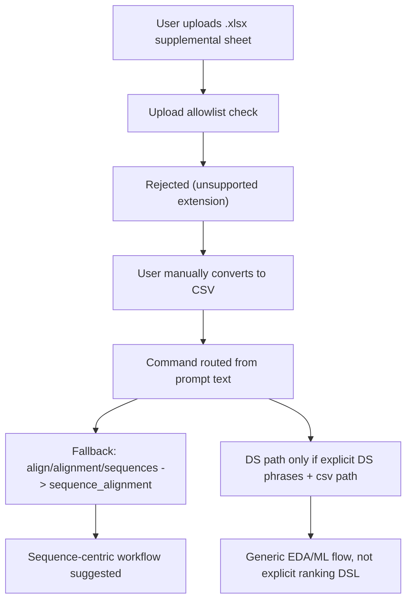
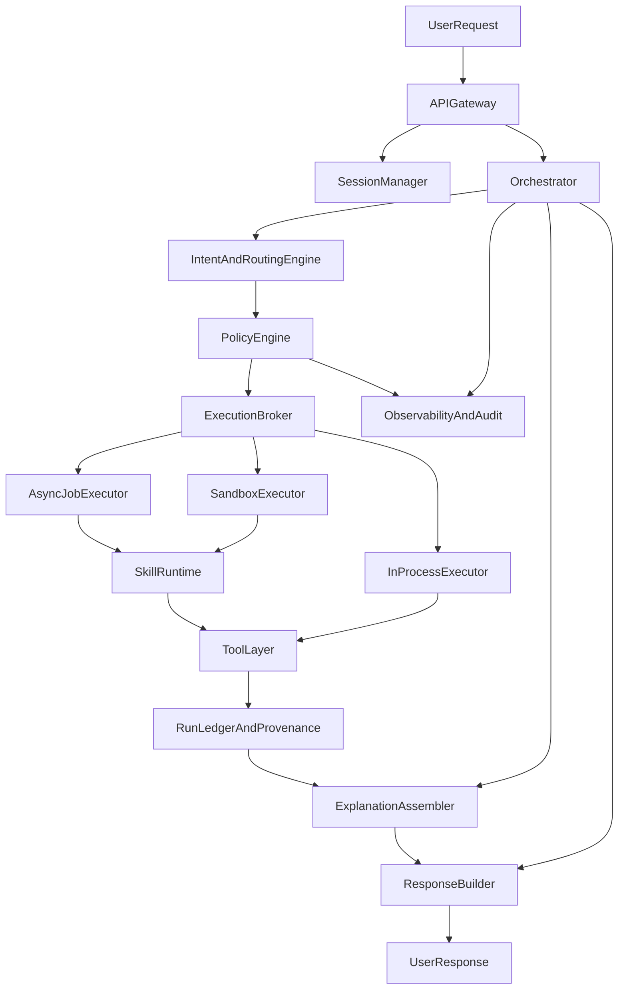

# Beta Feedback Root-Cause Investigation

## What Is Failing Today
- **Upload boundary rejects Excel**: both backend and frontend allowlists exclude `.xlsx`, so the file is rejected before analysis.
  - [backend/main.py](/Users/eoberortner/git/Helix.AI/backend/main.py)
  - [frontend/src/App.tsx](/Users/eoberortner/git/Helix.AI/frontend/src/App.tsx)
- **Tabular pipeline is CSV-only**: DS ingest uses `read_csv` and DS param extraction only detects `.csv` paths.
  - [backend/ds_pipeline/pipelines/ingest.py](/Users/eoberortner/git/Helix.AI/backend/ds_pipeline/pipelines/ingest.py)
  - [backend/command_router.py](/Users/eoberortner/git/Helix.AI/backend/command_router.py)
- **Routing is sequence-biased under ambiguity**: fallback maps broad terms like `align/alignment/sequences` to `sequence_alignment`; tool-generator prompt is bio/sequence framed.
  - [backend/command_router.py](/Users/eoberortner/git/Helix.AI/backend/command_router.py)
  - [backend/tool_generator_agent.py](/Users/eoberortner/git/Helix.AI/backend/tool_generator_agent.py)
- **Planner input extraction under-represents table files**: local URI extraction covers bio file types but not CSV/TSV/XLSX.
  - [backend/workflow_planner_agent.py](/Users/eoberortner/git/Helix.AI/backend/workflow_planner_agent.py)
- **Coverage gap**: tests/evals strongly cover sequence/rnaseq mapping; no benchmark cases for immunopeptidomics target ranking from structured tables.
  - [tests/evals/cases/router_tool_mapping.jsonl](/Users/eoberortner/git/Helix.AI/tests/evals/cases/router_tool_mapping.jsonl)
  - [benchmarks/cases](/Users/eoberortner/git/Helix.AI/benchmarks/cases)

## Why The Beta Scenario Failed


## Minimum Missing Capabilities (Product)
- **File ingestion parity**: actual support for `.csv/.tsv/.xlsx` (or docs corrected to current reality).
- **Excel sheet-aware ingest**: sheet selection (`ts_final`) and schema preview before routing.
- **Tabular intent as first-class**: classify operations like derive-column, ratio, sort, rank as table analysis intent.
- **Deterministic table operations layer**: safe execution of operations such as `median_tumor/max_median_gtex`, sorting, filtering, grouping.
- **Eval/benchmark scenarios**: add structured-table target-prioritization cases to release gates.

## Recommended Next Implementation Phases (when approved)
1. **Ingestion foundation**: enable `.tsv/.xlsx`, add parser abstraction (`ingest_tabular`) and sheet selection.
2. **Routing correction**: add `tabular_analysis` intent/tool route and reduce overly broad sequence fallback behavior.
3. **Execution capability**: support explicit column math/ranking requests and emit reproducible artifact tables.
4. **Quality gates**: add unit/integration/eval benchmark cases for immunopeptidomics ranking workflows.
5. **Docs alignment**: sync documented file support and user examples with implemented behavior.

## Prioritized Roadmap Catalog

### Now (P0: unblock real beta workflows)
- **Tabular upload UX parity (frontend + backend)**
  - Scope: support `.csv/.tsv/.xlsx` in upload allowlists; show precise backend rejection reasons in UI; preserve uploaded-file state across session restore.
  - Why now: current beta pain starts at file ingress and opaque failure handling.
  - Acceptance signals:
    - `.xlsx`/`.tsv` selectable and upload-attempted from UI.
    - user sees actionable error text (not only generic `Upload failed`).
    - uploaded files rehydrate from session state after refresh.
- **Sheet-aware tabular ingest**
  - Scope: add tabular ingest abstraction with Excel sheet selection/defaulting and schema preview (`columns`, inferred types, row counts).
  - Why now: immunopeptidomics and proteomics targets are commonly worksheet-based.
  - Acceptance signals:
    - `ts_final`-style sheet can be selected and loaded deterministically.
    - schema summary is persisted in run/session artifacts.
- **Tabular intent + deterministic operations**
  - Scope: route ranking/filter/derive-column requests to table analysis path instead of sequence/bulk-rnaseq defaults.
  - Why now: avoids incorrect sequence-centric workflow proposals for table tasks.
  - Acceptance signals:
    - prompts like `ratio median_tumor/max_median_gtex then rank` route to tabular analysis.
    - output includes derived column + sorted table artifact + provenance.
- **P0 benchmark gates**
  - Scope: add at least 2 benchmark/eval cases for structured target-ranking tasks (including immunopeptidomics-like table).
  - Acceptance signals:
    - release thresholds include these cases.
    - pass/fail reported in `artifacts/release_readiness.json`.

### Next (P1: expand high-demand omics breadth)
- **RNA-seq depth hardening (bulk + scRNA)**
  - Scope: strengthen robustness around DE, pathway, annotation, trajectory, and cell-cell communication flows.
  - Acceptance signals:
    - expanded eval set for representative bulk/scRNA prompts.
- **Variant/genomics workflows**
  - Scope: improve variant calling/annotation/CNV/GWAS routing and artifact provenance.
  - Acceptance signals:
    - canonical genomics scenarios mapped to stable tool paths and tests.
- **Epigenomics family coverage**
  - Scope: ChIP/ATAC/CUT&RUN/Hi-C/methylation planning + execution guardrails.
  - Acceptance signals:
    - each modality has at least one end-to-end benchmark case.
- **Network/regulatory and biomarker modeling**
  - Scope: GRN/co-expression/master regulator + survival/biomarker/PRS tasks as first-class intents.
  - Acceptance signals:
    - explicit routing targets and measurable evaluation tasks.

### Later (P2: advanced and adjacent capabilities)
- **Design/structure stack**
  - Scope: binder/primer/protein-structure/binding-affinity ML workflows.
  - Acceptance signals:
    - reproducible demo scenarios and domain validation checks.
- **Clinical intelligence and knowledge tasks**
  - Scope: trial landscaping and cross-dataset synthesis with clear citation/provenance.
  - Acceptance signals:
    - retrieval-backed outputs with auditable sources.
- **Workflow engineering UX**
  - Scope: HPC/Slurm/env portability/database-access guidance as composable assistant capabilities.
  - Acceptance signals:
    - repeatable runbooks/templates and integration tests.

## Suggested First Benchmark Gate Additions
- **Table target ranking (xlsx)**
  - Input: Excel workbook with `ts_final`-like sheet.
  - Task: compute `median_tumor / max_median_gtex`, rank descending, report top candidates with safety caveats.
- **Table target ranking (csv parity)**
  - Input: equivalent CSV.
  - Task: produce equivalent ranked output; confirm parity with Excel path.
- **Routing safety regression**
  - Input: prompts mentioning `targets`, `sheet`, `ratio`, `rank`.
  - Task: ensure no fallback to sequence alignment / unrelated RNA-seq routes.

## Helix Next Platform Pillars (cross-cutting)

### 1) Reproducibility by default
- **Run manifest contract**
  - Persist for every run: input artifact hashes, schema snapshot, tool/model versions, parameters, environment fingerprint, random seeds, and exact workflow graph.
- **Deterministic replay modes**
  - Support strict replay (`same inputs + same tool/model versions`) and best-effort replay (`documented drift warnings`).
- **Versioned outputs**
  - Every derived table/plot/model is immutable and linked to parent run IDs and artifact lineage.
- **Acceptance signals**
  - Replay of benchmark runs reproduces key metrics within tolerance.
  - provenance chain is machine-readable for all release-gated scenarios.

### 2) Monitoring and governance
- **Structured observability**
  - Emit per-step events: routing decision, skill/tool invocation, latency, retries, failures, fallback reason, and user-visible outcome.
- **Governance policy layer**
  - Define policy profiles (research, preclinical, regulated) controlling allowed tools, model families, data egress, and approval checkpoints.
- **Audit-ready logs**
  - Persist decision traces with redaction support and retention rules.
- **Acceptance signals**
  - dashboards expose success/failure/latency by modality and skill.
  - policy violations are blocked and auditable.

### 3) Sandbox execution architecture
- **Tiered execution**
  - Fast deterministic ops in-process; dynamic/generated code in isolated sandbox; large workflows on job infrastructure.
- **Sandbox guarantees**
  - no host filesystem access beyond mounted workspace scope, no unrestricted network by default, resource/time quotas, explicit allowlist for external endpoints.
- **Fail-safe fallback**
  - graceful degradation path when sandbox runtime dependency is missing; never silently attempt unsafe host execution.
- **Acceptance signals**
  - untrusted code paths always execute in sandbox tier or are blocked.
  - sandbox outages surface clear user remediation.

### 4) Security and safety controls
- **Data classification and handling**
  - tag sessions/artifacts by sensitivity; enforce encryption-at-rest, scoped access, and least-privilege execution identities.
- **Prompt/tool safety**
  - validate tool arguments against schemas; block high-risk command patterns; enforce secure defaults for file/network operations.
- **Secrets hygiene**
  - secrets only from managed stores; no logging of secrets; automatic redaction in traces and artifacts.
- **Scientific safety**
  - require uncertainty notes and assumption checks for clinically sensitive outputs.
- **Acceptance signals**
  - security test suite (authz, secret leak checks, sandbox escape checks) passes in release gate.

### 5) Design of experiments (DoE) as first-class capability
- **DoE planner module**
  - support factorial/fractional factorial, randomization, blocking, power-aware sample recommendations, and contrast planning.
- **Experiment metadata model**
  - encode factors, levels, replicates, batch variables, confounders, endpoints, and planned statistical tests.
- **Execution and revision loop**
  - allow users to revise design mid-session with impact analysis on downstream inference.
- **Acceptance signals**
  - benchmark cases validate correct design matrix construction, contrast specification, and interpretation caveats.

### 6) Educator component (tutorial + Q&A mode)
- **Guided learning workflows**
  - provide stepwise tutorials for common modalities (bulk RNA-seq, scRNA-seq, tabular target ranking, variant interpretation), with beginner/advanced tracks.
- **Context-aware help**
  - answer user questions using current session artifacts (data schema, workflow state, run outputs) so explanations are grounded in what the user actually ran.
- **Practice and validation**
  - optional checkpoint questions, “what to try next” prompts, and troubleshooting suggestions linked to observed errors.
- **Acceptance signals**
  - users can switch between `execute mode` and `educator mode` without losing session state.
  - tutorial outputs reference concrete session artifacts instead of generic textbook responses.

### 7) Explanation component (why/how transparency)
- **Decision rationale trace**
  - expose concise reasons for routing, tool selection, parameter defaults, and fallback choices.
- **Result/plot explanation layer**
  - provide interpretable summaries for tables/plots: why patterns appear, key assumptions, caveats, and likely causes of visual artifacts.
- **Counterfactual and sensitivity explanations**
  - answer “what changed this result?” and “what if we changed X?” based on lineage, contrasts, and parameter deltas.
- **Acceptance signals**
  - each run exposes a user-readable explanation block linked to machine-readable provenance.
  - plot/table explanation quality is benchmarked with rubric-based evals (correctness, completeness, caveat coverage).

## Integrated Delivery Sequence for Helix Next
- **Release A (Foundation)**
  - P0 tabular ingestion/routing + run manifest v1 + sandbox reliability baseline + core monitoring events.
- **Release B (Governed expansion)**
  - policy profiles + audit traces + security guardrails + initial DoE planner + educator mode v1 + expanded modality benchmarks.
- **Release C (Scale and assurance)**
  - full replay/reproducibility guarantees, advanced governance workflows, explanation layer v1, and cross-modality benchmark coverage aligned to roadmap families.

## Next Step: Technical Specification Workstream

### Objective
- Produce an implementation-ready technical specification for Helix Next covering architecture, interfaces, rollout, and quality gates.

### Spec package (recommended documents)
- **1. Product + capability scope spec**
  - supported use-case families, non-goals, release boundaries (A/B/C), and acceptance criteria.
- **2. System architecture spec**
  - agent/skill/tool architecture, routing flow, data model, execution tiers (in-process/sandbox/job), and governance controls.
- **3. Data + provenance spec**
  - run manifest schema, lineage model, replay semantics, and artifact/versioning rules.
- **4. Security/safety/governance spec**
  - policy profiles, authz boundaries, data classification, secrets handling, redaction, and audit logging.
- **5. Frontend UX spec**
  - upload/sheet/schema UX, educator mode, explanation surfaces, and failure-state UX.
- **6. Evaluation + release-gate spec**
  - benchmark suites, rubric criteria, threshold policy, and release readiness contract.

### Recommended drafting sequence
- **Step 1: Architecture skeleton**
  - finalize canonical component diagram and interface boundaries.
- **Step 2: P0 deep specs**
  - tabular ingestion/routing, reproducibility manifest v1, sandbox baseline, monitoring events.
- **Step 3: Governance + safety**
  - policy engine, audit model, and security test requirements.
- **Step 4: Educator + explanation**
  - user-facing contracts and provenance-linked rationale design.
- **Step 5: Testability and rollout**
  - migration plan, phased rollout flags, benchmark expansion, and rollback strategy.

### Definition of done for the technical specification
- all P0/P1 capabilities mapped to owners and interfaces.
- every new component has explicit input/output contracts.
- every release item has measurable acceptance tests and benchmark gates.
- security/safety controls are testable and tied to policy profiles.
- reproducibility and explanation requirements are enforced in output contracts.

## Section 1 Draft: System Architecture Spec (Helix Next)

### 1.1 Goals
- Build a generally applicable biotech/pharma assistant that supports multimodal workflows (tabular, omics, genomics, epigenomics, modeling) with reproducibility, safety, and explainability.
- Separate **decision-making** (agents) from **execution** (skills/tools) and **governance** (policy/observability/release gates).
- Ensure every run is auditable and replayable, with clear rationale for routing and outputs.

### 1.2 Non-goals (for initial architecture release)
- Full support of every niche modality in v1.
- Replacing all external workflow engines; Helix orchestrates and integrates rather than reimplementing everything.
- Fully autonomous execution in regulated contexts without human approval checkpoints.

### 1.3 Architectural principles
- **Deterministic where possible**: prefer typed contracts and deterministic skill/tool execution over free-form generated code.
- **Policy before execution**: route and execute only after policy checks (data class, tool allowlist, sandbox tier).
- **Provenance-first outputs**: no result without lineage metadata.
- **Composable capabilities**: new domains ship as skills + tests, not monolithic router changes.
- **Graceful degradation**: clear fallback behavior when dependency/tool/sandbox is unavailable.

### 1.4 Logical components
- **API Gateway / Session API**
  - request validation, auth/session handling, upload handling, endpoint orchestration.
- **Orchestrator**
  - coordinates planner/router, policy engine, execution broker, checkpoint manager, and response assembler.
- **Intent + Routing Engine**
  - classifies requests into capability families and chooses either deterministic skill path or controlled natural-command path.
- **Skill Runtime**
  - executes packaged skills with typed IO contracts and versioned metadata.
- **Tool Layer**
  - domain tools (bioinformatics, table ops, stats, visualization), each with schema-validated args.
- **Execution Broker**
  - chooses execution tier (in-process, sandbox, async job/cluster) based on risk/size/policy.
- **Policy Engine**
  - enforces profile rules (research/preclinical/regulated), data egress limits, required approvals.
- **Provenance + Run Ledger**
  - stores run manifests, lineage graph, artifacts, step logs, and replay metadata.
- **Observability + Audit**
  - event stream, metrics, traces, policy decisions, and redacted audit records.
- **Frontend Experience Layer**
  - upload UX, workflow controls, educator mode, explanation panels, and artifact browser.

### 1.5 Component interaction flow


### 1.6 Agent architecture (control plane)
- **PlannerAgent**
  - builds multi-step plans; returns typed step graph and explicit dependencies.
- **RouterAgent**
  - maps request to capability family + candidate skills/tools + confidence.
- **DomainAgents**
  - `TabularAgent`, `TranscriptomicsAgent`, `GenomicsAgent`, `EpigenomicsAgent`, `ClinicalModelingAgent`, `EducatorAgent`, `ExplainerAgent`.
- **Execution contract**
  - agents cannot execute arbitrary system operations directly; all execution passes through broker + policy + typed tool interfaces.

### 1.7 Skill architecture (capability plane)
- Skill package contract:
  - `skill_id`, `version`, `capability_family`, `input_schema`, `output_schema`, `preconditions`, `risk_class`, `supported_profiles`.
- Skill invocation contract:
  - immutable `skill_run_id`, normalized inputs, execution tier decision, produced artifacts with lineage links.
- Skill registration:
  - centralized skill registry with allowlist by agent and policy profile.

### 1.8 Execution tiering model
- **Tier 0: In-process deterministic**
  - lightweight table transforms, simple stats, metadata extraction.
- **Tier 1: Sandbox isolated**
  - generated code, untrusted parsing, moderate compute, restricted network/filesystem.
- **Tier 2: Async job infrastructure**
  - long-running or heavy workflows (cluster/cloud job runners).
- Tier selection inputs:
  - risk_class, data size, required binaries, latency budget, profile restrictions.

### 1.9 Data and state model (architecture-level)
- **Session**
  - user-level conversation/workflow container with profile and policy context.
- **Run**
  - one execution unit with plan graph, step records, environment and model/tool versions.
- **Artifact**
  - immutable output/input references with checksum and storage URI.
- **Lineage edge**
  - links artifact-to-run and run-to-run dependencies.
- **Explanation record**
  - user-facing rationale object linked to routing decisions and output artifacts.

### 1.10 Core interfaces (v1 contracts)
- `RouteRequest -> RouteDecision`
  - includes `capability_family`, `candidate_skills`, `confidence`, `rationale`.
- `PolicyCheckRequest -> PolicyDecision`
  - includes `allow|deny|require_approval`, rule matches, remediation.
- `ExecuteRequest -> ExecuteResult`
  - includes tier, step status, outputs, errors, structured logs.
- `RunManifestWriteRequest -> ManifestId`
  - atomically persists manifest + lineage references.
- `ExplainRequest -> ExplainResponse`
  - produces concise rationale for route/tool/output with caveats.

### 1.11 Reliability and failure handling
- **Checkpointing**
  - checkpoint before/after each plan step; resume from last consistent node.
- **Retry policy**
  - bounded retries with reason-aware backoff; no silent infinite loops.
- **Fallback policy**
  - deterministic fallback order documented per capability family.
- **User-visible errors**
  - every failure mapped to actionable remediation guidance.

### 1.11.1 Fallback matrix (authoritative policy table)
- Fallback decisions must be made by `(capability_family, failure_class, policy_profile)` and never by ad hoc keyword checks.
- `failure_class` values:
  - `transient`, `dependency`, `data_contract`, `policy_block`, `logic_failure`

| capability_family | failure_class | allowed_fallback_chain | forbidden_fallbacks | terminal_behavior_if_exhausted |
|---|---|---|---|---|
| `tabular_target_ranking` / `tabular_analysis` | `transient` | retry same route -> alternate deterministic table engine | any sequence/rnaseq/scRNA route | return actionable error + keep table context |
| `tabular_target_ranking` / `tabular_analysis` | `data_contract` | prompt for sheet/column mapping -> schema-guided retry | sequence alignment or unrelated omics pipeline | block with `TABULAR_*` remediation |
| `bulk_rnaseq_de` | `dependency` | alternate approved RNA-seq toolchain variant in same family | table-only or sequence-alignment-only fallback | block + tool/dependency remediation |
| `scrna_annotation` | `transient` | retry same scRNA path -> profile-approved scRNA variant | fallback to bulk RNA-seq or sequence alignment | block with scRNA-specific remediation |
| `variant_annotation` | `policy_block` | require approval -> restricted mode explanation-only | bypass policy to execute high-risk tools | deny with policy trace |
| `epigenomics_peak_analysis` | `dependency` | alternate peak caller within epigenomics family | cross-family fallback (e.g., transcriptomics) | block + dependency remediation |
| `educator` / `explainer` | `logic_failure` | regenerate explanation from manifest/lineage only | fabricate rationale without provenance | block with provenance integrity error |

- Enforcement rules:
  - if fallback candidate is not in allowed chain -> reject candidate and continue chain.
  - if candidate is in forbidden list -> emit critical policy event and fail run.
  - every fallback attempt emits `fallback_invoked` with reason and target.

### 1.12 Security and governance anchors in architecture
- Policy engine intercepts both route and execute paths.
- Tool calls are schema-validated and capability-scoped.
- Sandbox is mandatory for untrusted code paths.
- Audit events emitted for route decisions, policy decisions, execution outcomes, and artifact writes.
- Secrets only injected at runtime through managed secret providers; never persisted in run artifacts.

### 1.13 Frontend architecture implications
- Upload service must support structured table workflows (`csv/tsv/xlsx`) with sheet/schema UX.
- UI should render:
  - run timeline + status,
  - explanation panel (`why chosen`, `why result looks this way`),
  - provenance links to artifacts and upstream steps,
  - mode switch between execute/educator/explainer contexts.

### 1.14 Observability architecture
- Standard event taxonomy:
  - `route_decision`, `policy_decision`, `execution_started`, `execution_finished`, `execution_failed`, `artifact_persisted`, `explanation_generated`.
- Required labels:
  - session_id, run_id, step_id, capability_family, skill_id/version, execution_tier, policy_profile, latency_ms, status.
- SLO starter set:
  - route correctness (eval), execution success rate, median latency by tier, reproducibility replay success, policy violation block rate.

### 1.15 Migration and rollout architecture
- Feature-flagged rollout by capability family and profile.
- Backward-compatible API contracts for existing `/execute` and session flows.
- Dual-path period:
  - existing router path remains while new skill/runtime path is phased in.
- Release cutover criteria:
  - benchmark parity or better, no critical policy regressions, reproducibility checks passing.

### 1.16 Open questions to resolve in Section 2+
- Canonical schema format for skill IO contracts (JSON Schema vs Pydantic-exported schema).
- Registry storage and versioning strategy for skills (git-based vs DB-backed).
- Policy DSL choice and enforcement engine implementation.
- Exact artifact store contract for large binary and tabular outputs.
- How explanation quality is scored in automated evaluation.

## Section 2 Draft: P0 Deep Spec (Foundation Release)

### 2.1 Scope (P0 only)
- Deliver a reliable structured-table workflow path that supports:
  - upload (`.csv/.tsv/.xlsx`),
  - sheet-aware ingest,
  - deterministic ranking/filter/derive operations,
  - provenance + observability contracts.
- Keep existing non-table workflows operational and backward-compatible.

### 2.2 P0 capabilities and out-of-scope
- **In scope**
  - frontend upload parity for `.csv/.tsv/.xlsx`
  - backend tabular ingest abstraction with Excel sheet selection
  - `tabular_analysis` routing path for ratio/rank/sort/filter requests
  - deterministic execution for common table transforms
  - run manifest v1 + event schema v1
- **Out of scope (P0)**
  - full generalized notebook execution
  - advanced multi-modal joins across omics families
  - complete DoE engine (only placeholder hooks in manifest/events)

### 2.2.1 Universal file upload direction (post-P0 expansion)
- Target state: support broad scientific file uploads via a **policy-driven universal intake** instead of a narrow extension allowlist.
- Approach:
  - accept many file classes (tables, sequence files, alignment/variant files, matrices, metadata docs, archives where allowed),
  - classify and validate content before execution eligibility,
  - route only validated file types to compatible capability families.
- Important constraint:
  - "all kinds of files" means broad support with controlled handling, not automatic trust or execution.

### 2.3 User stories (P0 acceptance drivers)
- As a user, I can upload an Excel file and pick a sheet (`ts_final`) before analysis.
- As a user, I can ask for derived-column ranking (e.g., `median_tumor / max_median_gtex`) and receive sorted output.
- As a user, I can understand failures via actionable errors (missing columns, invalid sheet, divide-by-zero handling).
- As an operator, I can inspect route/tool decisions and replay run provenance.

### 2.4 API and contract changes

#### 2.4.1 Upload endpoints
- Keep `POST /session/{session_id}/uploads` contract shape; expand accepted extensions.
- Optional enhancement endpoint (P0 preferred):
  - `GET /session/{session_id}/uploads/{file_id}/preview`
  - returns format metadata for table files.

#### 2.4.1.a Universal intake metadata (expansion)
- Add normalized upload classification payload on ingest response:
```json
{
  "file_id": "upload_abc123",
  "detected_type": "table|sequence|alignment|variant|document|archive|unknown",
  "detected_format": "csv|tsv|xlsx|fasta|fastq|bam|vcf|pdf|zip|...",
  "mime_type": "text/csv",
  "safety_status": "accepted|quarantined|rejected",
  "reasons": ["MIME/extension mismatch", "contains executable macro"],
  "execution_eligibility": "none|preview_only|full"
}
```

#### 2.4.2 Tabular metadata preview response (new)
```json
{
  "file_id": "upload_abc123",
  "format": "xlsx",
  "sheets": [
    { "name": "ts_final", "n_rows_estimate": 5971, "n_cols_estimate": 33 },
    { "name": "pathway_enrich", "n_rows_estimate": 1200, "n_cols_estimate": 8 }
  ],
  "default_sheet": "ts_final",
  "warnings": []
}
```

#### 2.4.3 Tabular analysis execute payload extension
- Existing `/execute` remains primary.
- Add parser support for structured operation hints in command context metadata:
```json
{
  "session_id": "sess_x",
  "command": "Compute median_tumor / max_median_gtex and rank descending",
  "table_context": {
    "file_id": "upload_abc123",
    "sheet": "ts_final"
  }
}
```

### 2.5 Frontend P0 spec

#### 2.5.1 Upload UX
- Extend accepted extensions to `.csv,.tsv,.xlsx`.
- Show clear status phases:
  - `validating` -> `uploading` -> `uploaded` or `failed`.
- Surface backend error details directly (not only generic `Upload failed`).

#### 2.5.2 Session rehydration
- On app restore/new mount:
  - call session files endpoint,
  - repopulate uploaded file list with persisted metadata,
  - preserve file status and names across refresh.

#### 2.5.3 Sheet selection UX (for xlsx)
- If file is xlsx:
  - fetch preview,
  - show sheet dropdown,
  - persist chosen sheet per file in session context.
- Default selection behavior:
  - use backend `default_sheet` if provided; otherwise first sheet.

### 2.6 Backend P0 spec

#### 2.6.1 Ingest abstraction
- Introduce `ingest_tabular(path, options)` replacing csv-only assumption.
- Supported formats:
  - CSV (delimiter auto-detect fallback to comma),
  - TSV,
  - XLSX (sheet required or defaulted).
- Output contract:
  - normalized dataframe handle/table relation,
  - schema summary,
  - ingest warnings/errors.

#### 2.6.2 Tabular schema contract
```json
{
  "n_rows": 5971,
  "n_cols": 33,
  "columns": [
    { "name": "median_tumor", "dtype": "float64", "n_missing": 0 },
    { "name": "max_median_gtex", "dtype": "float64", "n_missing": 0 }
  ],
  "sample": [
    { "median_tumor": 23.8, "max_median_gtex": 0.00001 }
  ]
}
```

#### 2.6.3 Routing changes (P0)
- Add `tabular_analysis` route before sequence-alignment fallback.
- Trigger phrases and semantic cues:
  - `sheet`, `table`, `column`, `ratio`, `rank`, `sort`, `filter`, `group by`.
- Negative guard:
  - do not route table-context requests to sequence/rnaseq paths unless explicit sequence evidence exists.

#### 2.6.5 De-hardcoding migration: phrase routing -> capability agents
- Problem:
  - hard-coded phrase checks and brittle keyword maps cause misclassifications and wrong fallbacks.
- Target architecture:
  - replace phrase-first routing with a **capability router agent** + semantic classifiers + policy-constrained fallback matrix.
- Migration phases:
  1. **Shadow router mode**
     - run semantic router in parallel with legacy phrase router; log disagreements.
  2. **Guarded cutover**
     - route by semantic/capability decision for P0 families (`tabular`, `bulk_rnaseq`) while keeping legacy as monitored backup.
  3. **Legacy retirement**
     - progressively remove hard-coded phrase branches once disagreement and regression metrics are below thresholds.
- Required telemetry for migration:
  - `legacy_route`, `semantic_route`, `route_disagreement`, `final_route`, `fallback_invoked`.
- Release gate for de-hardcoding:
  - no new hard-coded routing phrases added for covered families.
  - disagreement rate and misclassification rate below approved threshold before each cutover.

#### 2.6.4 Deterministic tabular operations (P0 set)
- `derive_column` with arithmetic ops (`+ - * /`, null-safe behavior),
- `sort_rows`,
- `filter_rows` (simple predicates),
- `select_columns`,
- `top_k`.
- Required behavior:
  - all operations produce operation log entries in manifest,
  - all output tables persisted as artifacts (csv + optional preview json).

### 2.7 Error model (P0)
- Standardized user-recoverable error codes:
  - `TABULAR_UNSUPPORTED_FORMAT`
  - `TABULAR_SHEET_NOT_FOUND`
  - `TABULAR_COLUMN_NOT_FOUND`
  - `TABULAR_INVALID_EXPRESSION`
  - `TABULAR_EMPTY_RESULT`
  - `TABULAR_DIVIDE_BY_ZERO_WARNING`
- Each error includes:
  - `message`, `code`, `remediation`, `context` (file/sheet/column).

#### 2.7.1 Upload safety/content error codes (expansion)
- `UPLOAD_TYPE_MISMATCH`
- `UPLOAD_DISALLOWED_CONTENT`
- `UPLOAD_MALWARE_SUSPECTED`
- `UPLOAD_ARCHIVE_POLICY_BLOCKED`
- `UPLOAD_TOO_LARGE_FOR_PROFILE`
- `UPLOAD_QUARANTINED_REVIEW_REQUIRED`
- `UPLOAD_UNSUPPORTED_FOR_EXECUTION` (accepted for storage/preview but not executable)

### 2.8 Reproducibility manifest v1 (P0 minimum)

#### 2.8.1 Manifest shape
```json
{
  "run_id": "run_123",
  "session_id": "sess_x",
  "capability_family": "tabular_analysis",
  "inputs": [
    {
      "file_id": "upload_abc123",
      "uri": "sessions/sess_x/uploads/raw/media-5.xlsx",
      "checksum_sha256": "..."
    }
  ],
  "tabular_context": {
    "format": "xlsx",
    "sheet": "ts_final",
    "schema_hash": "..."
  },
  "operations": [
    { "op": "derive_column", "expr": "median_tumor / max_median_gtex", "output_col": "tumor_normal_ratio" },
    { "op": "sort_rows", "by": "tumor_normal_ratio", "direction": "desc" },
    { "op": "top_k", "k": 50 }
  ],
  "tool_versions": {
    "pandas": "x.y.z",
    "duckdb": "x.y.z"
  },
  "artifacts": [
    { "artifact_id": "art_1", "type": "table", "format": "csv", "uri": "..." }
  ]
}
```

### 2.9 Observability event schema v1 (P0 minimum)
- Emit:
  - `route_decision`
  - `tabular_ingest_started/finished/failed`
  - `tabular_operation_started/finished/failed`
  - `artifact_persisted`
- Required fields:
  - `timestamp`, `session_id`, `run_id`, `step_id`, `event_type`, `status`, `latency_ms`, `capability_family`.
- Recommended fields:
  - `file_id`, `sheet`, `operation_name`, `error_code`, `policy_profile`.

### 2.10 Policy + sandbox requirements for P0
- P0 table operations run in deterministic in-process tier by default.
- If operation path requires generated code (edge case), execution must move to sandbox tier.
- No outbound network needed for standard tabular analysis; enforce deny-by-default network policy in these runs.

### 2.11 Test plan (P0)
- **Unit**
  - ingest csv/tsv/xlsx + sheet selection
  - route classifier for tabular prompts vs sequence prompts
  - deterministic operation engine correctness
  - error mapping and remediation messages
- **Integration**
  - upload -> preview -> execute -> artifact persistence -> session rehydration
  - xlsx and csv parity on equivalent dataset
- **Eval/Benchmark**
  - target ranking scenario from `ts_final`-like data
  - routing safety regression (no sequence fallback for table requests)

### 2.12 Rollout plan (P0)
- Feature flags:
  - `HELIX_TABULAR_INGEST_V1`
  - `HELIX_TABULAR_ROUTING_V1`
  - `HELIX_UPLOAD_XLSX_TSV_V1`
- Rollout phases:
  - canary internal sessions -> beta cohort -> default enabled.
- Rollback:
  - disable flags independently (upload support, routing path, operation engine).

### 2.13 P0 definition of done
- Users can upload `.xlsx/.tsv/.csv` from frontend and see persisted file state.
- Users can run sheet-aware ranking workflows with deterministic outputs.
- Routing chooses `tabular_analysis` for target-ranking prompts with no sequence misrouting in eval set.
- Manifest v1 and event schema v1 are emitted for all P0 tabular runs.
- Added tests and benchmark cases pass in CI/release gate.

## Section 3 Draft: Data + Provenance Spec

### 3.1 Objectives
- Guarantee reproducibility, auditability, and explainability through explicit data lineage.
- Make every output traceable to exact inputs, operations, tool/model versions, and policy context.
- Enable deterministic replay and controlled drift detection across releases.

### 3.2 Core data model entities
- **Session**
  - workflow container with policy profile, user context, and lifecycle metadata.
- **Run**
  - execution instance with route decision, capability family, plan graph, and completion status.
- **Step**
  - operation node within a run (ingest/transform/tool/model/inference/report).
- **Artifact**
  - immutable data object consumed/produced by steps (table, plot, model, report, file).
- **Manifest**
  - normalized machine-readable run record and lineage references.
- **ExplanationRecord**
  - user-facing rationale linked to route and result artifacts.
- **PolicyDecisionRecord**
  - allow/deny/approval records and matched policy rules.

### 3.3 Canonical identifiers
- `session_id`: stable UUID.
- `run_id`: unique per execution, ordered per session.
- `step_id`: deterministic within run (`run_x.step_001`).
- `artifact_id`: immutable artifact reference.
- `manifest_id`: versioned manifest identifier.
- `explanation_id`, `policy_decision_id`: linked records for rationale and governance.

### 3.4 Lineage graph model
- Run-scope DAG edges:
  - `Artifact -> Step -> Artifact`, plus `Run -> Step`.
- Cross-run lineage:
  - downstream runs reference upstream artifacts by `artifact_id` + checksum.
- Required edge types:
  - `produced_by_step`
  - `consumed_by_step`
  - `derived_from_artifact`
  - `supersedes_artifact`

### 3.5 Artifact contract
- Required metadata:
  - `artifact_id`, `type`, `format`, `uri`, `checksum_sha256`, `size_bytes`, `created_at`, `run_id`, `step_id`.
- Optional metadata:
  - `schema_hash`, `preview`, `title`, `tags`, `sensitivity_class`, `retention_policy`.
- Immutability rule:
  - payload immutable once persisted; any update creates a new artifact with `supersedes_artifact` edge.

### 3.6 Manifest v1 schema (formalized)
- Required top-level fields:
  - `manifest_version`, `manifest_id`, `session_id`, `run_id`, `created_at`, `capability_family`, `status`.
- Input block:
  - input artifacts with URIs, checksums, and source descriptors.
- Environment block:
  - tool/model versions, execution tier, environment fingerprint.
- Steps block:
  - ordered operations with signatures, parameters, and terminal statuses.
- Outputs block:
  - produced artifacts and summary metrics.
- Governance block:
  - policy profile, policy decisions, approval outcomes, redaction markers.
- Explanation block:
  - linked explanation IDs and concise rationale summary.

### 3.7 Example manifest skeleton
```json
{
  "manifest_version": "1.0.0",
  "manifest_id": "mf_2026_0001",
  "session_id": "sess_123",
  "run_id": "run_456",
  "created_at": "2026-04-16T16:00:00Z",
  "capability_family": "tabular_analysis",
  "status": "success",
  "inputs": [
    {
      "artifact_id": "art_in_1",
      "uri": "sessions/sess_123/uploads/raw/media-5.xlsx",
      "checksum_sha256": "..."
    }
  ],
  "environment": {
    "execution_tier": "in_process",
    "tool_versions": { "pandas": "x.y.z", "duckdb": "x.y.z" },
    "model_versions": {}
  },
  "steps": [
    {
      "step_id": "run_456.step_001",
      "op": "derive_column",
      "parameters": { "expr": "median_tumor/max_median_gtex", "output_col": "ratio" },
      "status": "success"
    }
  ],
  "artifacts": [
    {
      "artifact_id": "art_out_1",
      "type": "table",
      "format": "csv",
      "uri": "sessions/sess_123/runs/run_456/artifacts/ranked.csv",
      "checksum_sha256": "..."
    }
  ],
  "governance": {
    "policy_profile": "research",
    "policy_decisions": ["pol_1"]
  },
  "explanations": ["exp_1"]
}
```

### 3.8 Replay semantics
- **Strict replay**
  - requires identical input checksums, operation signatures, tool/model versions, and policy profile.
  - expected outputs match checksum or strict metric tolerances.
- **Compatibility replay**
  - allows version drift with explicit drift report.
  - emits changed components and impact summary.
- Replay outcome classes:
  - `replay_match`, `replay_within_tolerance`, `replay_drift`, `replay_blocked`.

### 3.9 Drift detection and tolerance policy
- Drift dimensions:
  - schema drift, value drift, ranking drift, metric drift.
- P0 minimum checks:
  - top-k overlap, key metric deltas, null-rate deltas.
- Tolerance policy:
  - thresholds defined per capability family (tabular ranking, DE, modeling, etc.).

### 3.10 Storage and retention contracts
- Primary stores:
  - session ledger store (JSON/document), artifact object store, optional lineage index store.
- Retention classes:
  - `short_term`, `standard`, `regulated`.
- Lifecycle rules:
  - manifests outlive ephemeral execution logs.
  - hard delete requires policy approval and audit emission.

### 3.11 Redaction and privacy requirements
- Sensitive manifest/event fields are tokenized or redacted by policy.
- Secret-bearing values are never persisted.
- Redaction metadata required:
  - `redacted_fields`, `redaction_policy_id`, `redacted_at`.

### 3.12 Provenance query interfaces
- `GET /session/{session_id}/runs/{run_id}/manifest`
- `GET /session/{session_id}/runs/{run_id}/lineage`
- `GET /artifacts/{artifact_id}/provenance`
- `POST /runs/{run_id}/replay`
- Responses provide machine-parseable data and concise human summaries.

### 3.13 Observability linkage requirements
- All core events include:
  - `session_id`, `run_id`, `step_id`, `artifact_id?`, `policy_decision_id?`.
- Event stream and manifest IDs must be cross-correlatable.
- Missing-link events are integrity violations.

### 3.14 Integrity validation rules
- Manifest integrity assertions:
  - referenced artifacts exist and checksum-verify,
  - all steps have terminal statuses,
  - all produced artifacts link to producing steps.
- On integrity failure:
  - run status becomes `failed_integrity`,
  - high-severity audit event emitted,
  - run excluded from release-gate credit.

### 3.15 Migration strategy (from current state)
- Introduce manifest writer in shadow mode first.
- Backfill recent runs when possible and mark as `backfilled=true`.
- Enforce manifest requirements in release gates only after shadow validation window.

### 3.16 Test and quality gates (Section 3)
- Unit:
  - manifest schema validation, checksum logic, lineage edge generation.
- Integration:
  - run -> manifest -> lineage query -> replay roundtrip.
- Eval/Benchmark:
  - reproducibility replay success thresholds by capability family.
- Release gate:
  - fail readiness if manifest integrity or replay thresholds fail.

### 3.17 Open decisions for Section 4+
- Authoritative contract schema technology (`JSON Schema` vs generated Pydantic/OpenAPI contracts).
- Lineage index backend choice for graph traversal performance.
- Retention defaults by policy profile and deployment tier.

## Section 4 Draft: Security / Safety / Governance Spec

### 4.1 Objectives
- Enforce least-privilege, policy-driven execution across all Helix workflows.
- Prevent unsafe tool execution, data leakage, and ungoverned external access.
- Ensure scientific outputs include safety context (assumptions, uncertainty, limitations).
- Make governance testable and auditable through deterministic policy records.

### 4.2 Threat model (P0/P1 focus)
- **Data risks**
  - unauthorized access to sensitive datasets, cross-session leakage, accidental exfiltration.
- **Execution risks**
  - arbitrary code execution outside sandbox, unsafe shell/network operations, dependency confusion.
- **Model risks**
  - prompt injection, tool misuse, unsafe recommendations in high-impact contexts.
- **Governance risks**
  - bypassed approvals, missing audit traces, non-reproducible decisions.
- **Scientific risks**
  - misleading certainty, omitted caveats, invalid conclusions from low-quality inputs.

### 4.3 Policy profile model
- Define profile tiers:
  - **`research`**: flexible defaults, moderate controls, fast iteration.
  - **`preclinical`**: tighter tool/network controls, mandatory provenance checks.
  - **`regulated`**: strict allowlists, approval gates, strongest audit/retention constraints.
- Profile binding:
  - profile assigned at session creation; can only be escalated (not downgraded) without privileged action.

### 4.4 Governance enforcement points
- **Ingress gate**
  - upload type/size checks, content-classification tags, schema sanity checks.
- **Route gate**
  - capability/tool selection must pass policy before execution.
- **Execution gate**
  - execution tier decision (in-process/sandbox/async) validated against profile.
- **Egress gate**
  - outbound network, export/download sharing, and external API calls policy-checked.
- **Output gate**
  - results blocked if safety/provenance minimums are not met.

### 4.5 Policy decision contract
- Input:
  - `session_id`, `policy_profile`, `requested_capability`, `requested_tools`, `data_sensitivity`, `execution_tier`.
- Output:
  - `decision`: `allow | deny | require_approval`
  - `matched_rules`: array of rule IDs
  - `remediation`: user/operator guidance
  - `policy_decision_id`: persisted for audit linkage

### 4.6 Access control and identity model
- Session-scoped access tokens with explicit permissions (`read_artifact`, `execute_skill`, `export_result`).
- Service identities segmented by subsystem (API, executor, artifact store).
- No shared admin credentials across runtime tiers.
- All privileged operations require explicit identity assertion and audit log entry.

### 4.7 Data classification and handling
- Data classes:
  - `public`, `internal`, `sensitive`, `restricted`.
- Classification inputs:
  - user-declared tags + heuristic detectors + policy overrides.
- Handling rules by class:
  - encryption at rest/in transit,
  - allowed execution tiers,
  - external egress restrictions,
  - retention windows.

### 4.7.1 Upload intake safeguards (required for broad file support)
- **Layer 1: Transport and basic checks**
  - file size/profile limits, checksum generation, extension + MIME consistency checks.
- **Layer 2: Content classification**
  - lightweight sniffing/classification to infer file family and parser compatibility.
- **Layer 3: Security scanning**
  - malware/signature scan, archive traversal checks, blocked executable/script payload checks.
- **Layer 4: Policy gate**
  - determine `accepted`, `quarantined`, or `rejected` based on policy profile.
- **Layer 5: Execution eligibility**
  - mark files as `preview_only` vs `full` execution eligible.
- **Layer 6: Audit and explainability**
  - persist intake decision, scanner outcomes, and policy rule IDs in audit records.

### 4.7.2 Disallowed content baseline policy
- Default disallow:
  - executable binaries/scripts intended for host execution,
  - archives containing blocked file classes or path traversal patterns,
  - encrypted/obfuscated payloads that cannot be scanned under policy.
- Default quarantine:
  - unknown binary formats, scanner-timeout cases, ambiguous MIME/signature results.
- Default allow (with validation):
  - known scientific data formats and documents, subject to parser-level validation.

### 4.7.3 Safe handling for accepted-but-untrusted files
- Store in isolated upload area with no direct execution permission.
- Parse through constrained readers only (no shell invocation).
- Require explicit policy approval to elevate from `preview_only` to `full`.

### 4.8 Secrets and key management
- Secrets only from managed providers (env refs, vault/secret manager integrations).
- No secrets in:
  - prompts,
  - run manifests,
  - user-visible error payloads.
- Automatic redaction in logs/events/artifacts.
- Key rotation and revocation events must be auditable.

### 4.9 Sandbox security requirements
- Mandatory sandbox for untrusted/generated code paths.
- Sandbox controls:
  - readonly base image,
  - restricted filesystem mounts,
  - deny-by-default network policy,
  - CPU/memory/time quotas,
  - process isolation and no host privilege escalation.
- Failure behavior:
  - if secure sandbox unavailable, block risky path or require explicit privileged override.

### 4.10 Tool and command safety model
- Tool invocation must pass JSON-schema validation.
- Tool risk classes (`low`, `medium`, `high`) map to profile-specific controls.
- High-risk operations require:
  - explicit user confirmation and/or operator approval depending on profile.
- Shell-like operations:
  - command allowlist + argument sanitization + forbidden pattern checks.

### 4.11 Prompt/model safety controls
- Prompt injection mitigation:
  - isolate untrusted content sections,
  - suppress direct instruction-following from file payloads,
  - enforce tool call contracts regardless of model output.
- Model output guardrails:
  - validate against schema and policy constraints before execution.
- Human-in-the-loop:
  - approval checkpoints for high-risk or policy-sensitive branches.

### 4.12 Scientific safety and quality requirements
- Every high-impact analysis output must include:
  - assumptions,
  - uncertainty/limitations,
  - data quality caveats,
  - recommended validation steps.
- Block or warn conditions:
  - missing critical metadata,
  - unstable model diagnostics,
  - low-sample or high-missingness risk thresholds.

### 4.13 Educator/explainer safety constraints
- Educator mode:
  - must distinguish instructional examples from validated run outputs.
- Explanation mode:
  - rationale must reference actual provenance records; no fabricated justifications.
- For regulated profile:
  - explanation includes policy-decision references and approval trace IDs.

### 4.14 Audit and compliance logging
- Required auditable events:
  - auth decisions, policy decisions, approvals, execution starts/ends/failures, export attempts, redaction actions.
- Audit record minimum fields:
  - actor identity, timestamp, session/run/step IDs, action, result, policy rule IDs.
- Tamper evidence:
  - append-only log strategy or signed log batches.

### 4.15 Incident response and kill switches
- Global kill switches:
  - disable capability families, disable external egress, disable generated-code execution.
- Incident workflow:
  - detect -> isolate profile/capability -> preserve evidence -> notify operators -> controlled recovery.
- Mandatory post-incident artifact:
  - incident summary + impacted sessions + remediation actions.

### 4.16 Governance dashboards and SLOs
- Dashboard dimensions:
  - policy denials by rule/profile,
  - approval latency and backlog,
  - sandbox block/failure rates,
  - redaction action counts,
  - safety warning frequency by capability.
- SLO starter set:
  - 100% policy decision coverage on routed executions,
  - 0 critical secret leaks in logs,
  - high-risk actions always gated by required approval policy.

### 4.17 Security and governance test strategy
- **Unit**
  - policy rule evaluation, schema guardrails, redaction utilities.
- **Integration**
  - end-to-end deny/allow/approval flows, sandbox enforcement, egress blocking.
- **Adversarial**
  - prompt injection cases, tool-arg fuzzing, sandbox escape attempts, secret leak probes.
- **Release gate**
  - fail readiness on critical vulnerabilities, policy bypasses, or audit coverage regressions.

### 4.18 P0/P1 implementation boundaries
- **P0**
  - profile framework (`research`), policy decision contract, schema validation, sandbox baseline, audit event minimum set.
- **P1**
  - full profile set (`preclinical`, `regulated`), approval workflows, redaction expansion, adversarial safety regression suite.

### 4.19 Open decisions for Section 5+
- Policy DSL implementation approach (declarative rules engine vs code-based policies).
- Approval UX ownership and escalation paths in frontend.
- Signed audit log storage backend and retention tiers by deployment model.

## Section 5 Draft: Frontend UX Spec

### 5.1 Objectives
- Make complex biotech workflows usable for both experts and learners.
- Ensure upload and table-analysis paths are explicit, debuggable, and trustworthy.
- Surface rationale, provenance, and governance outcomes without overwhelming users.

### 5.2 UX design principles
- **Progressive disclosure**: show essential controls first; expand advanced details on demand.
- **State clarity**: every run/file has visible state and next action.
- **Evidence-linked UI**: explanations and claims link back to artifacts/lineage.
- **Safe defaults**: prevent accidental destructive actions and unsupported paths.

### 5.3 Primary user journeys (P0/P1)
- **Journey A: Structured table analysis (P0)**
  - upload file -> validate -> preview schema/sheets -> select sheet -> run ranking/filter analysis -> inspect output + explanation.
- **Journey B: Iterative refinement (P0)**
  - reuse uploaded file/artifacts -> adjust formula/filters -> rerun -> compare outputs.
- **Journey C: Educator mode (P1)**
  - switch to guided walkthrough with session-aware Q&A and checkpoints.
- **Journey D: Explanation mode (P1)**
  - click “Why this?” for route/tool/output/plot rationale and provenance links.

### 5.4 Information architecture
- **Left panel**
  - session navigation, uploaded files, run history, mode toggle.
- **Main workspace**
  - prompt composer, active run timeline, result cards (tables/plots/reports).
- **Right insights panel**
  - explanation summary, provenance graph snippets, warnings/caveats.
- **Footer status rail**
  - environment/profile status (policy profile, execution tier, warnings).

### 5.5 Upload and ingestion UX (P0)

#### 5.5.1 File picker and drag-drop
- Accepted types shown inline: `.csv`, `.tsv`, `.xlsx` (+ existing sequence types where relevant).
- Per-file state chips:
  - `validating`, `uploading`, `uploaded`, `failed`.

#### 5.5.2 Validation feedback
- Client-side validation:
  - unsupported extension, file-size limits.
- Server-side validation:
  - show backend error code + remediation text.
- Error example:
  - `TABULAR_SHEET_NOT_FOUND: Sheet 'ts_final' not found. Choose one of: ...`

#### 5.5.3 Sheet and schema preview
- For xlsx:
  - sheet dropdown with row/column estimates.
- Schema preview card:
  - column list, inferred types, missingness highlights, top warnings.

#### 5.5.4 Session rehydration behavior
- On reload/session restore:
  - repopulate uploaded file list from persisted session metadata.
- Retain:
  - selected sheet,
  - last successful table context per file.

### 5.6 Prompt composer and execution UX
- Composer supports:
  - plain natural language,
  - optional structured context chips (`file`, `sheet`, `columns`).
- On run submit:
  - show route preview badge (e.g., `Tabular Analysis`) with confidence indicator.
- During execution:
  - timeline stepper updates by step status.
- After execution:
  - result summary + downloadable artifacts + “Explain result” action.

### 5.7 Results UX (tables/plots/artifacts)
- **Table result card**
  - sortable preview, top-k display, key derived columns highlighted.
- **Artifact actions**
  - download CSV, copy operation summary, open provenance.
- **Compare runs**
  - quick diff view for row counts, top-k overlap, key metric deltas.

### 5.8 Explanation UX (P1)
- Entry points:
  - “Why this route?”
  - “Why this result?”
  - “Why does this plot look like this?”
- Explanation card sections:
  - route rationale,
  - method/tool rationale,
  - data caveats and uncertainty,
  - provenance links.
- Must include:
  - explanation confidence and caveat severity badges.

### 5.9 Educator UX (P1)
- Mode toggle:
  - `Execute` / `Educator` / `Explain`.
- Educator mode behaviors:
  - guided steps tied to current session artifacts,
  - optional quiz/checkpoint prompts,
  - “Try next” recommendations.
- Guardrail:
  - educator output clearly labeled as instructional when not a validated run result.

### 5.10 Governance and safety UX
- Show active policy profile in persistent header badge.
- Approval-required states:
  - explicit blocking dialog with policy reason and required approver action.
- Sensitive action confirmations:
  - export/share/delete flows require contextual confirmation.
- Safety notices:
  - highlight assumptions/uncertainty for high-impact outputs.

### 5.11 Error and recovery UX
- Standardized error panel:
  - `code`, concise message, remediation steps, optional “retry with suggested fix”.
- Recovery shortcuts:
  - reselect sheet,
  - map missing columns,
  - retry with previous successful context.
- Preserve user input on error to avoid rework.

### 5.12 Accessibility and usability requirements
- Keyboard navigable upload, sheet selection, and result interactions.
- WCAG-compliant contrast and screen-reader labels for status/state indicators.
- Responsive behavior for laptop-first; compact mode for narrow viewports.

### 5.13 Frontend telemetry spec
- Required UI events:
  - `file_upload_started`, `file_upload_failed`, `sheet_selected`, `run_submitted`, `run_completed`, `explain_opened`, `educator_mode_entered`.
- Include:
  - `session_id`, `run_id?`, `file_id?`, `capability_family`, `latency_ms`, `error_code?`.
- Telemetry must avoid sensitive payload content.

### 5.14 Component-level implementation map
- **Upload module**
  - file queue, validation, progress, persisted state hydration.
- **Table context module**
  - sheet selector + schema preview + context chips.
- **Run timeline module**
  - stepper + statuses + failure links.
- **Explanation module**
  - rationale cards with provenance links.
- **Mode manager**
  - execute/educator/explain switch with scoped behavior.

### 5.15 P0/P1 UX rollout boundaries
- **P0**
  - upload parity (`csv/tsv/xlsx`), sheet/schema UX, run timeline, improved error handling, artifact actions.
- **P1**
  - educator mode, explanation side panel, run compare view, approval UX refinements.

### 5.16 UX test strategy
- **Unit/component tests**
  - upload state transitions, sheet selection persistence, error rendering.
- **Integration tests**
  - upload -> preview -> execute -> result -> explanation open.
- **E2E tests**
  - key user journeys A/B, including refresh rehydration.
- **Usability checks**
  - task-completion rate/time for table ranking workflow.

### 5.17 Open decisions for Section 6+
- Whether mode toggle is global per session or per-run context.
- Depth of inline table preview vs dedicated artifact page.
- Final approval UX ownership between frontend and policy service.

## Section 6 Draft: Evaluation + Release-Gate Spec

### 6.1 Objectives
- Convert product quality expectations into measurable, automated release criteria.
- Prevent regressions in routing accuracy, workflow correctness, safety, and reproducibility.
- Ensure Helix release readiness is based on full-system evidence, not partial test success.

### 6.2 Evaluation architecture
- **Layer 1: Deterministic correctness tests**
  - unit + integration + contract tests for core behavior and APIs.
- **Layer 2: Workflow fidelity tests**
  - multi-step end-to-end scenarios across target capability families.
- **Layer 3: Safety/governance tests**
  - policy enforcement, security controls, sandbox guarantees, audit coverage.
- **Layer 4: Benchmark quality tests**
  - domain scenario scoring with rubric-based output assessment.

### 6.3 Suite taxonomy
- `unit_backend`
- `unit_frontend`
- `integration_backend`
- `integration_frontend`
- `workflow_e2e`
- `routing_eval`
- `benchmark_tabular`
- `benchmark_transcriptomics`
- `benchmark_genomics`
- `benchmark_epigenomics`
- `benchmark_educator_explainer`
- `security_governance`
- `reproducibility_replay`

### 6.4 Core rubric dimensions (benchmark scoring)
- **Task correctness**
  - outputs satisfy requested operation and expected logic.
- **Routing correctness**
  - selected capability/tool path is appropriate for intent/data.
- **Result quality**
  - useful ranking/analysis quality against expected reference behavior.
- **Safety and caveat coverage**
  - uncertainty, assumptions, and risk warnings are present when required.
- **Provenance completeness**
  - manifests/artifact lineage/explanations are present and linked.
- **Reproducibility**
  - replay match or within defined tolerance.

### 6.5 Example benchmark cases (minimum)
- **Tabular ranking xlsx**
  - input: workbook with target sheet
  - task: derive ratio + rank + top-k output
  - checks: route correctness, table correctness, manifest/event presence.
- **Tabular ranking csv parity**
  - same task on csv-equivalent data
  - checks: parity of top-k and metric outputs vs xlsx path.
- **Routing safety regression**
  - prompts with `sheet/ratio/rank` terms
  - checks: no sequence/rnaseq fallback unless explicit evidence.
- **Educator grounding**
  - educator responses reference actual session artifacts.
- **Explanation grounding**
  - explanations cite real provenance IDs and operation history.

### 6.6 Release threshold model
- Threshold classes:
  - **Critical** (must pass): security/governance, reproducibility integrity, core workflow scenarios.
  - **High**: routing correctness, tabular benchmark quality, integration stability.
  - **Advisory**: non-blocking quality indicators (latency drift within warning bands).
- Example gate defaults (initial):
  - critical suites: 100% pass
  - high suites: >= 95% pass
  - advisory suites: reported, not blocking unless severe regression detected.

### 6.6.1 Routing and fallback hard gates
- For release-candidate gate sets:
  - `forbidden_fallback_count` must equal `0`.
  - `critical_family_misclassification_count` must equal `0`.
  - `route_disagreement_rate` (semantic vs expected contract) must be below threshold.
- Critical families (minimum):
  - `tabular_target_ranking`, `variant_annotation`, `bulk_rnaseq_de`.

### 6.7 Regression policy
- Any regression in:
  - critical security controls,
  - policy enforcement,
  - manifest integrity/replay,
  - or core P0 tabular cases
  => automatic release block.
- Snapshot/fixture updates must document intent and expected behavior change.
- No removal of failing tests to obtain green status.

### 6.8 Performance and reliability gates
- Required metrics:
  - route latency p50/p95,
  - execution success rate,
  - retry rate,
  - timeout rate,
  - sandbox failure rate.
- Gate behavior:
  - severe latency or reliability regressions block release if beyond allowed thresholds.

### 6.9 Security/governance gate checks
- Mandatory checks:
  - policy decisions emitted for all routed executions,
  - high-risk actions gated by approval policy,
  - no critical secret leakage findings,
  - sandbox enforcement for untrusted code paths,
  - audit event coverage minimum met.

### 6.10 Reproducibility gate checks
- Manifest integrity:
  - all release-evaluated runs have valid manifests + lineage completeness.
- Replay checks:
  - strict replay pass for deterministic benchmark subset.
  - compatibility replay within tolerance for broader subset.
- Drift reporting:
  - any drift above threshold must be documented as blocker or approved exception.

### 6.11 Evaluation data management
- Fixed benchmark fixtures with version tags.
- Scenario metadata includes:
  - modality, difficulty, risk class, expected outputs, scoring weights.
- Data changes require:
  - changelog entry and baseline refresh approval.

### 6.12 Release readiness output contract
- Machine-readable artifact required:
  - `artifacts/release_readiness.json`
- Must include:
  - timestamp, code identifier, suites run, pass/fail counts,
  - benchmark scores, threshold comparisons,
  - blocker list, final readiness boolean.

### 6.13 CI/CD integration
- Pipeline stages:
  - quick checks (unit/contracts),
  - targeted integration,
  - full benchmark + security + replay (release candidate).
- Branch policy:
  - no merge for release branches when critical gates fail.
- Promote-on-green:
  - only builds with complete gate evidence can be promoted.

### 6.14 Exception and waiver process
- Temporary waivers allowed only for non-critical gates.
- Waiver record must include:
  - owner, rationale, expiry date, mitigation plan.
- Expired waivers automatically convert to blockers.

### 6.15 Governance of benchmark evolution
- Add new benchmark scenarios when:
  - a bug class is fixed,
  - a new capability family is added,
  - or user feedback reveals recurring failure mode.
- Benchmark council cadence (engineering + domain leads):
  - periodic review of thresholds, flake rates, and scenario coverage.

### 6.16 P0/P1 release-gate boundaries
- **P0 required for Release A**
  - tabular xlsx/csv parity benchmarks,
  - routing safety regression suite,
  - manifest + event integrity checks,
  - minimum security/governance checks.
- **P1 required for Release B/C**
  - expanded modality suites (omics/genomics/epigenomics),
  - educator/explainer quality rubrics,
  - full policy profile and approval-flow coverage.

### 6.17 Done criteria for spec package completion
- Section 1–6 produce consistent contracts and no conflicting thresholds.
- Every roadmap item (P0/P1/P2) maps to at least one measurable gate.
- Release readiness decision is fully automatable from generated artifacts.
- Open risks and waiver paths are explicit and governed.

### 6.18 Benchmark Program from Phylo + NGS101 Use Cases

#### 6.18.1 Benchmark corpus construction
- Build a **source-tagged benchmark catalog** from:
  - [Phylo use cases](https://phylo.bio/use-cases)
  - [NGS101 tutorials](https://ngs101.com/tutorials/)
- For each collected use case, store:
  - `source` (`phylo` or `ngs101`)
  - `source_use_case_name`
  - `normalized_capability_family`
  - `difficulty` (`basic`, `intermediate`, `advanced`)
  - `risk_class` (`low`, `medium`, `high`)
  - `input_modalities` (table, bulk_rnaseq, scrna, genomics, epigenomics, etc.)
  - `expected_output_types` (table, plot, report, model, explanation)

#### 6.18.2 Normalization and mapping contract
- Maintain a single mapping file (machine-readable), e.g.:
  - `benchmarks/use_case_catalog.yaml`
- Example normalized families:
  - `tabular_target_ranking`
  - `bulk_rnaseq_de`
  - `scrna_annotation`
  - `cell_cell_communication`
  - `variant_annotation`
  - `epigenomics_peak_analysis`
  - `survival_biomarker_modeling`
  - `network_regulatory_analysis`
- Every source use case must map to one primary family and optional secondary families.

#### 6.18.3 Scenario template (required fields)
- Each benchmark case should define:
  - `id`, `title`, `family`, `source_refs`
  - `input_fixtures` (paths/URIs + checksums)
  - `prompt` (user-style request)
  - `required_steps` (what must occur)
  - `forbidden_routes` (what must not occur)
  - `scoring` rubric weights
  - `safety_requirements` (required caveats/warnings)
  - `provenance_requirements` (manifest/event/lineage expectations)

#### 6.18.4 Dataset split strategy
- Create three benchmark subsets:
  - **Dev set**: used during feature development (visible to agents).
  - **Validation set**: used for regression checks in CI.
  - **Release holdout**: unseen gate set for final readiness decisions.
- Enforce source balance:
  - each subset includes both Phylo-derived and NGS101-derived cases.

#### 6.18.5 Coverage requirements by release
- **Release A (P0)**
  - mandatory families:
    - `tabular_target_ranking` (from beta + table-centric use cases)
    - `bulk_rnaseq_de` (at least one representative path)
  - minimum: 2 Phylo-derived + 4 NGS101-derived scenarios.
- **Release B (P1)**
  - add families:
    - `scrna_annotation`, `cell_cell_communication`, `variant_annotation`, `epigenomics_peak_analysis`
  - minimum: 12+ scenarios with medium/advanced difficulty mix.
- **Release C (P2)**
  - include cross-family and educator/explainer scenarios:
    - survival/biomarker, network/regulatory, explanation-grounding, educator-grounding.

#### 6.18.6 Scoring model for source-derived cases
- Score each scenario across:
  - `routing_correctness`
  - `workflow_correctness`
  - `output_quality`
  - `safety_caveats`
  - `provenance_completeness`
  - `replay_reproducibility`
- Weighted score formula:
  - `total = sum(weight_i * metric_i)`
- Set family-specific minimums where needed (e.g., stricter provenance for high-risk families).

#### 6.18.7 Regression triage policy for benchmark failures
- On failed benchmark case:
  - classify failure cluster (`routing`, `ingest`, `execution`, `safety`, `provenance`, `explanation`).
  - patch root cause first, then rerun smallest affected subset.
  - promote fix to wider suites only after local-green.
- Add every newly discovered real-world failure mode as a new benchmark case.

#### 6.18.8 Benchmark artifacts and reporting
- Persist benchmark outputs to:
  - `artifacts/benchmark_results/` (raw case outputs and scores)
  - `artifacts/failure_summaries/` (concise failure analyses)
  - `artifacts/release_readiness.json` (aggregate pass/fail and thresholds)
- Include per-source reporting:
  - pass rates for `phylo`-derived vs `ngs101`-derived scenarios.

#### 6.18.9 Immediate implementation tasks for this benchmark program
- Create `benchmarks/use_case_catalog.yaml` from current scraped catalog.
- Add initial source-tagged scenario files under:
  - `benchmarks/cases/tabular/`
  - `benchmarks/cases/transcriptomics/`
  - `benchmarks/cases/routing_safety/`
- Implement scorer updates to enforce:
  - source coverage checks,
  - family coverage checks,
  - holdout gating in release candidate pipeline.

## Section 7 Draft: Autonomous Coding Agent Instruction Architecture

### 7.1 Objective
- Define how to configure coding agents (rules + skills + control loops) so they can autonomously build, test, and stabilize Helix Next with minimal human intervention and strong safety.

### 7.2 Agent operating model
- **Conductor agent**
  - owns backlog selection, planning, decomposition, and final merge-readiness checks.
- **Specialist implementation agents**
  - scoped by subsystem (frontend, backend, security, benchmarks, docs).
- **Verification agents**
  - run tests, triage failures, enforce release gates, and produce readiness evidence.
- **Review/audit agent**
  - checks policy compliance, provenance completeness, and risk regressions.

### 7.3 Instruction stack (priority order)
- **Layer 1: Core immutable rules**
  - safety, non-destructive operations, no secret leakage, required test evidence.
- **Layer 2: Project rules**
  - Helix architecture boundaries, test philosophy, artifact requirements, release-gate policy.
- **Layer 3: Task-specific rules**
  - current milestone constraints (P0/P1), file scope, acceptance criteria.
- **Layer 4: Skills**
  - reusable procedural playbooks (routing fix loop, tabular ingest, benchmark authoring, regression triage).

### 7.4 Rule taxonomy for Helix agents
- **Safety rules**
  - never bypass policy gates or security checks; no unsafe execution shortcuts.
- **Scope rules**
  - stay within assigned files/components unless explicit dependency coupling requires expansion.
- **Quality rules**
  - every behavior change must include/update tests.
- **Evidence rules**
  - persist run/test/benchmark results to required artifacts.
- **Release rules**
  - do not declare readiness unless all gate thresholds pass.

### 7.5 Skill taxonomy for Helix agents
- **Implementation skills**
  - `tabular-ingest-implementation`, `routing-guardrails`, `frontend-upload-ux`.
- **Testing skills**
  - `add-unit-and-integration-tests`, `benchmark-case-authoring`, `fix-until-green`.
- **Governance skills**
  - `security-regression-check`, `policy-enforcement-validation`, `provenance-integrity-check`.
- **Stabilization skills**
  - `failure-cluster-triage`, `minimal-safe-fix`, `rollback-prep`.
- **Documentation skills**
  - `update-spec-and-artifacts`, `change-log-with-risk-summary`.

### 7.6 Agent autonomy boundaries
- Agents may autonomously:
  - implement scoped changes,
  - run approved test suites,
  - iterate on failures,
  - update artifacts/spec docs.
- Agents must require human approval for:
  - policy/profile changes,
  - destructive data operations,
  - threshold waivers,
  - major architecture deviations.

### 7.7 Planning and execution loop (per task)
- **Step 1: Plan**
  - read relevant rules/skills, define target files, define acceptance tests.
- **Step 2: Implement**
  - minimal safe code change honoring architecture contracts.
- **Step 3: Verify**
  - run smallest meaningful tests, then expand to integration/benchmark as needed.
- **Step 4: Diagnose**
  - cluster failures by root cause; avoid shotgun edits.
- **Step 5: Iterate**
  - repeat until green or explicit blocker identified.
- **Step 6: Evidence**
  - write artifacts (`worklog`, `test_results`, `failure_summaries`, `release_readiness`).

### 7.8 Multi-agent orchestration pattern
- Parallelize independent tracks:
  - frontend UX, backend ingest/routing, test/benchmark updates.
- Serialize dependent tracks:
  - schema contract changes before downstream integration updates.
- Conductor merges only when:
  - specialist + verifier + audit agents all report pass.

### 7.9 Required agent outputs per task
- **Change summary**
  - what changed and why.
- **Validation summary**
  - tests/benchmarks run and outcomes.
- **Risk note**
  - known limitations and residual risk.
- **Artifact links**
  - pointers to stored evidence files.

### 7.10 Failure handling policy
- If tests fail:
  - classify as code defect, flaky test, environment issue, or threshold drift.
- If blocked:
  - produce blocker report with impact and recommended next action.
- Never:
  - disable tests to pass gates,
  - silently widen scope,
  - claim completion without evidence.

### 7.11 Prompting template for autonomous tasks
- **Task goal**
  - specific behavior change and success criteria.
- **Scope**
  - allowed files/components.
- **Rules to enforce**
  - safety, architecture, testing, release-gate constraints.
- **Skills to apply**
  - list of relevant implementation/testing/governance skills.
- **Required outputs**
  - code, tests, artifacts, and verification summary format.

### 7.12 Metrics for agent effectiveness
- cycle time per accepted task,
- first-pass test success rate,
- regression introduction rate,
- benchmark improvement rate,
- % tasks completed with full evidence package.

### 7.13 Adoption plan (phased)
- **Phase A**
  - single-agent with strict verifier gate.
- **Phase B**
  - conductor + 2–3 specialists + verifier.
- **Phase C**
  - full multi-agent pipeline with governance auditor and automatic readiness scoring.

### 7.14 Immediate next implementation artifacts
- Create project rules:
  - `agent-autonomy-boundaries.mdc`
  - `agent-testing-and-evidence.mdc`
  - `agent-security-governance.mdc`
- Create project skills:
  - `helix-p0-tabular-delivery/SKILL.md`
  - `helix-benchmark-authoring/SKILL.md`
  - `helix-fix-until-green/SKILL.md`
  - `helix-provenance-integrity/SKILL.md`

## Implementation Readiness Checklist (Release A / P0)

### 1) Scope and priorities
- [ ] P0 scope is locked (`upload + ingest + tabular routing + deterministic ops + manifest/events v1`).
- [ ] Out-of-scope items are explicitly documented (no stealth expansion).
- [ ] Release A success criteria are agreed and measurable.

### 2) Architecture and contracts
- [ ] Section 1 architecture boundaries are accepted (agents/skills/tools/policy/broker).
- [ ] Section 2 API/contract changes are accepted (upload preview, table context, routing behavior).
- [ ] Section 3 manifest + lineage contracts are accepted for P0.
- [ ] Section 4 governance enforcement points are accepted for P0.

### 3) Open decisions resolved
- [ ] Contract schema approach chosen (`JSON Schema` or generated contract model).
- [ ] Policy implementation approach chosen (rules engine vs code policies).
- [ ] Lineage index/storage approach chosen for P0 scale.
- [ ] Frontend mode behavior decision made (global session vs per-run).

### 4) Work breakdown and ownership
- [ ] Backend owner assigned (ingest abstraction, routing, deterministic table ops).
- [ ] Frontend owner assigned (upload UX, sheet/schema preview, rehydration).
- [ ] Governance/security owner assigned (policy checks, audit events, sandbox guardrails).
- [ ] Test/benchmark owner assigned (unit/integration/eval/replay).
- [ ] Conductor owner assigned for autonomous agent orchestration.

### 5) Agent operating setup
- [ ] Core project rules prepared (`autonomy boundaries`, `testing/evidence`, `security/governance`).
- [ ] Initial project skills prepared (`p0 tabular delivery`, `benchmark authoring`, `fix until green`, `provenance integrity`).
- [ ] Human approval boundaries configured (policy changes, waivers, destructive actions).
- [ ] Required artifacts for each task are enforced (`worklog`, `test_results`, `failure_summaries`, `release_readiness`).

### 6) Quality gates and thresholds
- [ ] Critical/high/advisory threshold values are finalized for Section 6.
- [ ] Critical gate suites are mapped into CI (security/governance, replay integrity, core tabular workflows).
- [ ] Benchmark fixture set for P0 is frozen/versioned.
- [ ] Waiver process and expiry rules are defined.

### 7) Environment and tooling readiness
- [ ] Required dependencies are available for P0 (`xlsx` parsing stack, table engine dependencies).
- [ ] Sandbox baseline is verified for risky execution paths.
- [ ] Telemetry/event pipeline can ingest required event schema v1 fields.
- [ ] Artifact storage paths and retention defaults are validated.

### 8) Go/No-Go decision
- [ ] All checklist sections above are green **OR** exceptions are documented with owners and expiry dates.
- [ ] Final implementation kickoff decision recorded:
  - [ ] **GO**: begin Release A implementation.
  - [ ] **NO-GO**: resolve blockers first.

## Final Blockers to Implementation GO

### MVP autonomy critical path (ordered)
1. **Approval-first execution contract**: ensure every non-trivial biological request returns a plan preview (`workflow_planned`) and only executes after explicit user approval.
2. **Semantic router shadow rollout**: run semantic/capability routing in shadow mode alongside current routing and capture disagreement/forbidden-fallback metrics.
3. **Routing cutover + hardcoded fallback reduction**: tighten/remove phrase-based default fallbacks, enforce cutover thresholds, and keep rollback switches in place.
4. **Universal ingestion baseline**: support tabular + omics file families with intake safeguards (classify/scan/gate/audit) and deterministic parameter extraction.
5. **Provenance + replay guarantees**: require manifest/lineage/replay signals for all benchmark-critical runs and block release if missing.
6. **Benchmark and compliance release gate**: pass split benchmark suites (including forbidden-route/fallback checks) and clear fixture compliance/retention requirements.

### A) Architecture and contract decisions (must resolve)
- [x] Finalize contract schema approach (`JSON Schema` vs generated model contracts).
- [x] Finalize policy implementation approach (declarative rules engine vs code policies).
- [x] Finalize lineage index backend and query strategy for target scale.
- [x] Finalize mode scope behavior (`execute/educator/explain` as session-level or run-level).
- [x] Freeze authoritative fallback matrix and forbidden fallback definitions.

#### A.1 Decisions adopted for kickoff (default unless explicitly revised)
- **Contract schemas**: JSON Schema as authoritative runtime contract; generated model types are derived artifacts.
- **Policy implementation**: declarative rules-first policy engine with code hooks for advanced checks.
- **Lineage backend (P0/P1)**: document/JSON manifest store + indexed edge table; full graph DB deferred.
- **Mode scope**: mode switch is session-level by default, with per-run override support in UI/API.
- **Fallback policy source of truth**: `Section 1.11.1 Fallback matrix` is authoritative and release-gated.

### B) Ownership and delivery planning (must resolve)
- [x] Assign named owners for:
  - [x] backend ingest/routing
  - [x] frontend UX/state rehydration
  - [x] governance/security/policy
  - [x] benchmark/scoring infrastructure
  - [x] autonomous agent orchestration
- [x] Produce sprint-level implementation sequence with dependency mapping.
- [x] Define sign-off authorities for architecture, security, benchmark, and release readiness.

#### B.1 Ownership matrix (role-based; map to individuals at kickoff)
- **backend ingest/routing** -> Backend Lead
- **frontend UX/state rehydration** -> Frontend Lead
- **governance/security/policy** -> Security Lead
- **benchmark/scoring infrastructure** -> QA/Benchmark Lead
- **autonomous agent orchestration** -> AI Platform Lead
- **release readiness consolidation** -> Tech Lead / Engineering Manager

#### B.2 Sprint-level sequence (starting order)
- **Sprint 1**
  - implement P0 ingest/routing foundation + upload UX parity + manifest/events v1 wiring.
- **Sprint 2**
  - complete benchmark scenario/scorer implementation + routing shadow mode + fallback gate checks.
- **Sprint 3**
  - complete governance hardening (upload safeguards, policy enforcement, audit coverage) + release-candidate gate run.

#### B.3 Sign-off authorities
- **Architecture sign-off** -> Tech Lead
- **Security/governance sign-off** -> Security Lead
- **Benchmark/gate sign-off** -> QA/Benchmark Lead
- **Final release-readiness sign-off** -> Engineering Manager (with all prior sign-offs attached)

### C) Benchmark and testing implementation (must resolve)
- [x] Convert `benchmarks/use_case_catalog.yaml` entries into executable scenario files.
  - [x] Bootstrap initial executable scenarios:
    - `benchmarks/cases/tabular/phylo-biomarker-panel-design.yaml`
    - `benchmarks/cases/transcriptomics/ngs101-bulk-rnaseq-core-de.yaml`
    - `benchmarks/cases/routing_safety/tabular-no-sequence-fallback.yaml`
  - [x] Generator at `benchmarks/scoring/generate_scenarios.py` expanded catalog to cover all current use cases.
  - [ ] Maintain source-case parity tracking as the catalog grows (add a check that every `use_cases[]` entry resolves to a scenario file).
- [x] Implement scorer support for:
  - [x] forbidden route checks
  - [x] forbidden fallback checks
  - [x] provenance completeness checks
  - [x] replay reproducibility checks
  - [x] Implemented in `benchmarks/scoring/use_case_gate_scorer.py`.
  - [x] Unit-tested in `tests/unit/benchmarks/test_use_case_gate_scorer.py`.
- [x] Create and lock benchmark splits (`dev`, `validation`, `release_holdout`).
  - [x] Locked split manifest at `benchmarks/splits.yaml`.
- [x] Define holdout access policy to prevent implementation overfitting.
  - [x] Policy defined at `benchmarks/HOLDOUT_ACCESS_POLICY.md`.
- [x] Wire critical benchmark suites into CI release-candidate pipeline.
  - [x] Workflow at `.github/workflows/benchmark-gate.yml` validates scenarios, runs scorer unit tests, executes suite via `benchmarks/scoring/run_suite.py`, uploads `artifacts/benchmark_results/gate_report.json`, and fails on critical regressions.

### D) Data fixture and compliance readiness (must resolve)
- [x] Approve benchmark fixture datasets (licensing, privacy, sensitivity classification).
  - [x] Approval registry created at `benchmarks/compliance/fixture_approval_registry.yaml`.
  - [x] All currently referenced scenario fixtures have explicit compliance entries.
  - [ ] Replace `pending` placeholder fixtures with approved real fixtures before release.
  - [x] Replacement execution plan created at `benchmarks/compliance/FIXTURE_REPLACEMENT_PLAN.yaml`.
- [x] Version fixture datasets and define update governance workflow.
  - [x] Governance policy defined at `benchmarks/compliance/FIXTURE_VERSIONING_GOVERNANCE.md`.
  - [x] Compliance validator added at `benchmarks/compliance/validate_fixture_compliance.py`.
  - [x] CI check wired in `.github/workflows/benchmark-gate.yml`.
- [x] Confirm retention/redaction policy for benchmark artifacts and logs.
  - [x] Policy defined at `benchmarks/compliance/RETENTION_REDACTION_POLICY.md`.

### E) Routing migration readiness (must resolve)
- [x] Implement semantic/capability router shadow mode.
  - [x] Added `CommandRouter.route_command_with_shadow()` with env-gated shadow diagnostics (`HELIX_ROUTER_SHADOW_MODE`).
  - [x] `/execute` routing paths now use shadow-enabled routing wrapper.
- [x] Define cutover thresholds (route disagreement, misclassification rate, forbidden fallback count).
  - [x] Thresholds documented in `benchmarks/routing_cutover_policy.yaml`.
- [x] Define rollback triggers and rollback procedure for routing cutover.
  - [x] Rollback triggers and playbook documented in `benchmarks/routing_cutover_policy.yaml`.
- [x] Block new hard-coded phrase routing additions for covered families.
  - [x] Default broad alignment fallback replaced with conservative `_should_sequence_alignment_fallback(...)`.
  - [x] CI guard added via `benchmarks/compliance/validate_routing_policy.py` and wired into benchmark workflow.

### F) Security and policy enforcement readiness (must resolve)
- [x] Confirm P0 policy profile defaults and enforcement points.
  - [x] Defined in `benchmarks/compliance/SECURITY_POLICY_PROFILE_P0.yaml`.
  - [x] Validation check added in `benchmarks/compliance/validate_security_policy.py`.
- [x] Implement upload intake safeguards pipeline (classify/scan/gate/audit).
  - [x] Runtime policy evaluation added in `backend/orchestration/upload_intake_policy.py`.
  - [x] Enforced in `backend.main._persist_upload_to_session` with block/allow/allow-with-approval outcomes.
- [x] Validate sandbox baseline for untrusted execution paths.
  - [x] Baseline documented in `benchmarks/compliance/SANDBOX_BASELINE.md`.
  - [x] Presence enforced by `benchmarks/compliance/validate_security_policy.py`.
- [x] Confirm approval workflow behavior for policy-blocked/high-risk actions.
  - [x] Added policy approval endpoint: `POST /session/{session_id}/uploads/approve`.
  - [x] `execute_plan` now blocks with 409 when policy-approval-required uploads are still pending.
- [x] Ensure audit event coverage for all gated operations.
  - [x] Structured policy audit events emitted for upload blocked/accepted/approved and execution blocked states.

### G) Performance and cost readiness (must resolve)
- [x] Set latency targets (p50/p95) by capability family and execution tier.
  - [x] Defined in `benchmarks/performance_cost_policy.yaml` under `latency_targets_seconds.by_capability_family`.
- [x] Set budget guardrails (model/tool execution cost per run/session).
  - [x] Defined in `benchmarks/performance_cost_policy.yaml` under `budget_guardrails_usd`.
  - [x] Aligned top-level release thresholds in `benchmarks/release_thresholds.yaml`.
- [x] Validate infrastructure capacity assumptions for sandbox and async tiers.
  - [x] Capacity assumptions defined in `benchmarks/performance_cost_policy.yaml`.
  - [x] Cross-validated against `backend/config/environment_capabilities.yaml`.
- [x] Add performance regression checks to release gate policy.
  - [x] Added validator `benchmarks/compliance/validate_performance_cost_policy.py`.
  - [x] Wired into `.github/workflows/benchmark-gate.yml`.

### H) Artifacts and evidence readiness (must resolve)
- [x] Confirm required artifact outputs are auto-generated:
  - [x] `artifacts/worklog.md`
  - [x] `artifacts/test_results/`
  - [x] `artifacts/failure_summaries/`
  - [x] `artifacts/benchmark_results/`
  - [x] `artifacts/release_readiness.json`
  - [x] Implemented via `benchmarks/compliance/bootstrap_artifacts.py`.
- [x] Confirm release readiness artifact includes threshold comparison and blocker summary.
  - [x] Enforced by `benchmarks/compliance/validate_artifacts_readiness.py`.
  - [x] Validated in CI via `.github/workflows/benchmark-gate.yml`.

### Final GO rule
- [ ] **Implementation GO is allowed only when all sections A–H are green or have approved, time-bounded waivers with owners and expiry.**